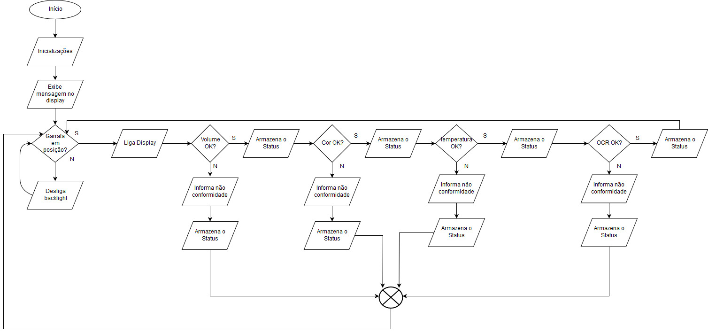

# Projeto Integrado 2 - 2019/1
IFSC Câmpus Florianópolis

Departamento Acadêmico de Eletrônica

Professores: Fernando Pedro Henrique de Miranda

​					   Luiz Alberto de Azevedo

Alunos: Guilherme Camargo Valese

​			   Jéssica Ramos Ribeiro

## 1 Introdução

A Indústria 4.0 é considerada como a Quarta Revolução Industrial. A primeira envolveu utilização de máquinas, a segunda linhas de montagem e produção em massa, a terceira empregou automação e a quarta envolve máquinas que se comunicam entre si. Enquanto as outras revoluções industriais foram marcadas pelo crescimento das linhas de produção, popularização de máquinas e produção em massa, a indústria 4.0 caracteriza-se pela forma de se unir diversas tecnologias que permitam a fusão do mundo físico, digital e biológico (ABDI). Isso inclui sistemas físico-cibernéticos, internet das coisas, computação na nuvem e computação cognitiva. Um sistema físico-cibernético visa a integração de processos físicos e computacionais. Ou seja, os computadores e redes podem monitorar o processo físico de fabricação em um determinado processo. O uso destas tecnologias permite a operação modular e descentralizada das fábricas, podendo inclusive serem controladas a distância por meio da internet. Sensores posicionados ao longo da cadeia produtiva realizam a análise dos processos e por meio da IA (Inteligência Artificial), podem tomar decisões sem a intervenção humana (JORNAL DA GLOBO, 2018). Segundo a ABDI (Agência Brasileira de Desenvolvimento Industrial) “a estimativa anual de redução de custos industriais no Brasil, a partir da migração da indústria para o conceito 4.0, será de, no mínimo, R$ 73 bilhões/ano.” As rápidas mudanças nas tecnologias de informação e comunicação romperam os limites entre a realidade virtual e o mundo real. A ideia por trás da Indústria 4.0 é criar uma rede social onde as máquinas possam se comunicar umas com as outras, chamada Internet of Things( IoT) e com as pessoas, Internet of People (IoP). A Internet das coisas é o que permite que objetos e máquinas, ou sensores, se comuniquem uns com os outros, assim como os seres humanos. A integração dessa tecnologia permite que os objetos funcionam e resolvam problemas de forma independente. Naturalmente, isso não o que realmente acontece, uma vez que os seres humanos podem intervir. Celulares, tablets, laptops, televisores e até mesmo relógios estão se tornando cada vez mais interconectados. Os serviços de Internet visam criar um ambiente que simplifique todos os dispositivos conectados para poder tirar o máximo proveito destes produtos e assim simplificar o processo. A Indústria 4.0 é definitivamente uma abordagem revolucionária para as técnicas de fabricação. O conceito levará fabricantes a um nível de otimização e produtividade superiores. As recompensas econômicas são imensas.

## 2 Concepção

#### Quadro 1

| Delimitadores Tecnológicos   | Tecnologias | Quantidade(s) |
| ---------------------------- | ----------- | ------------- |
| Verificação do Rótulos (OCR) | Webcam      | 1             |
| Temperatura                  | MLX90614    | 1             |
| Cor                          | TSC 3200    | 1             |
| Ultrassônico                 | JSN-SR04T   | 1             |
| Posição                      | TCRT5000    | 3             |
| LCD                          | HD44780     | 1             |
| Código de barras             | LV1000      | 1             |

Para todas as verificações que forem positivas, o processo continuará de onde estava. Porém quando a mesma obtiver um valor fora do esperado, a garrafa será retirada do processo e a próxima garrafa iniciará o processo do começo.

## 2.1 Raspberry Pi

​	O Raspberry PI é um mini computador do tamanho de um cartão de crédito desenvolvido no Reino Unido pela fundação Raspberry Pi originalmente para ensino da computação básica em escolas. Baseado em um *system on a chip* (SoC) Broadcom BCM2835, que inclui um processador ARM1176JZF-Sde 700 MHz, GPU VideoCore IV, e 512 MB de memória RAM. O armazenamento dos dados se dá em um cartão SD. A placa do Raspberry possui as seguintes dimensões: 85,60 mm de largura × 53,98 mm de comprimento.  Sua facilidade de uso, baixo custo e comunidade ativa fazem do Raspberry uma opção viável para diversos projetos, principalmente. Atualmente existem diversas distros disponíveis para uso, como Arch Linux, Debian, Ubuntu, etc. Para este projeto foi escolhido o Debian pela afinidade dos autores com o mesmo.

## 2.2 Display LCD 16x02

​	Módulos de display LCD de caracteres alfanuméricos são interfaces de comunicação visual muito úteis. Eles se encontram em quase todos os aparelhos domésticos, eletroeletrônicos, automóveis, instrumentos de medição etc. Por ser altamente padronizado seu custo é baixo. Este é um recurso que mesmo antigo, continua em uso, com suas inúmeras formas, cores, tamanhos e preços. A tecnologia predominante é o LCD (*Liquid Crystal Display*), porém já se pode encontrar alguns baseados em LEDs orgânicos (OLED).

​	O módulo LCD utilizado no projeto foi o Hitachi HD44780 que inclui caracteres ASCII, caracteres japoneses e alguns símbolos em duas linhas de 16 caracteres. 

## 2.3 Sensor de temperatura MLX90614

​	O MLX90614 é um termômetro infravermelho para medições de temperatura sem contato. O Sensor de Temperatura MLX90614 tem uma faixa de medição entre -40 a 125°C para temperatura ambiente e entre -70 a 380°C para medição de temperatura de objetos. Ele é capaz de realizar as duas medições simultaneamente, e a precisão da medição é de 0,5°C.

​	Um ADC interno de 17 bits e um poderoso DSP contribuem para a alta precisão e resolução do MLX90614. A comunicação com o microcontrolador é feita via interface I2C ocupando assim apenas 2 pinos do microcontrolador. A alimentação desse módulo é de 3,3V.

## 2.4 Sensor Ultrassônico

​	O JSN-SR04T é um sensor de distância ultra-sônico à prova d'água, fácil de usar, com uma faixa de 25 a 450 cm. O sensor vem com um cabo de 2,5 m de comprimento que se conecta a uma placa de fuga que controla o sensor e faz todo o processamento do sinal. Um sensor de distância ultrassônico funciona enviando ondas de ultra-som. Essas ondas de ultra-som são refletidas de volta por um objeto e o sensor 	ultrassônico às detecta.

## 2.5 Sensor de cor

​	O sensor de cor TCS3200 é um detector de cor completo, incluindo um chip sensor TAOS TCS3200 RGB e 4 LEDs brancos. O TCS3200 pode detectar e medir um intervalo quase ilimitado de cores visíveis. As aplicações incluem leitura de tiras de teste, classificação por cor, detecção e calibração de luz ambiente e combinação de cores, etc. O sensor opera com tensão de 2,7 à 5,5 V. E suas dimensões são 31 x 25 x 10mm.

## 2.6 Sensor de posição

​	Esse sensor é composto por um LED emissor de infravermelho e um foto transistor. O LED emite um feixe de luz invisível ao olho humano, o qual é refletido por uma superfície próxima (3~15mm) e capturado pelo foto transistor, que possui uma película que filtra a luz natural, permitindo a passagem do infravermelho emitido pelo LED. Dessa forma, de acordo com a reflexividade da superfície, o foto transistor recebe um valor maior ou menor de reflexão, mediante o qual pode ser determinada a cor sobre a qual se encontra.

## 2.7 Leitura OCR

​	Para fazer a leitura OCR do rótulo, foi utilizado uma webcam. O termo webcam é uma abreviação de Web Câmera,  uma câmera conectada ao computador.

​	Existem inúmeros tipos de webcams. A maioria pode ser conectada via USB ou até mesmo wireless, podendo ter a posição, zoom e foco ajustados. 

Após a captura da imagem, a mesma é convertida para um arquivo de texto por meio do software de reconhecimento óptico tesseract. O tesseract é um software open source criado originalmente pela HP e mantido pelo Google, sua principal aplicação é a conversão de imagens em arquivos txt. Este arquivo é lido e então procurado pelas *strings*  “suco” e “suco de uva”.

## 2.8 Código de barras

​	Para a leitura do código de barras, foi utilizado o sensor LV1000, que inclui todo o processamento de imagem em um circuito integrado, enviando os caracteres reconhecidos via interface serial. Por não possuir material de fácil acesso na internet, a placa foi analisada para buscar as funções de cada pino. A documentação sobre este sensor ainda está em desenvolvimento.

## 3 Metodologia

​	Foi utilizado o método de pesquisa exploratória com a finalidade de analisar os sensores que poderiam ser utilizados no projeto. Tendo como base os sensores disponíveis no laboratório que foi a razão pela qual os sensores de presença, LCD e o sensor de cor, foram escolhidos. No início do projeto o microcontrolador utilizado foi o Arduino UNO, porém seria necessário a utilização de um Raspberry para a leitura OCR, então todos códigos foram modificados para serem compatíveis com o Raspberry PI. O sensor ultrassônico, foi escolhido de acordo com seu formato, que é compatível com o da garrafa, pois este foi posicionado alguns centímetros acima da tampa da garrafa. Para o sensor de temperatura, foi optado por um que não precisa entrar em contato com o que precisa ser medido, uma vez que o líquido pode ser contaminado neste processo.

A pesquisa exploratória foi realizada também para a realização dos códigos. Uma vez que cada sensor tem  que ter suas entradas e saídas configuradas, tensões de alimentação, entre outros requisitos. Os códigos foram pesquisados no GitHub e adaptados para o projeto.	

O projeto tem caráter qualitativo. Visando o melhor funcionamento da plataforma para evitar problemas com as garrafas e seu conteúdo.

## 4 DESENVOLVIMENTO

​	O projeto consiste na elaboração de uma plataforma para fazer a leitura dos sensores de acordo com uma garrafa de suco de uva. As leituras devem oferecer o volume, temperatura, a cor e a leitura do rótulo da garrafa. 

​	Quando a garrafa é colocada na primeira posição, o sensor de posição detecta ela e manda um sinal para o leitor de código de barras, que apenas vai liberar o sensor ultrassônico, se o código de barras estiver correto. Então a leitura da altura de líquido na garrafa poderá ser realizada através do sensor ultrassônico. Sendo assim o volume é mostrado no LCD e de acordo com a tolerância estabelecida, se o volume for 10 % acima ou abaixo do esperado a sistemática para esta garrafa é parada e ela deve ser descartada ou ter o volume de líquido corrigido.

​	Uma vez que a garrafa passou no teste de medida do volume, esta pode passar para a segunda etapa. Onde um sensor de presença detecta se ela está posicionada corretamente, e a medição da temperatura é realizada. A temperatura deve estar abaixo dos 30 graus Celsius, para que esta garrafa possa ir para a próxima etapa. Se o valor for abaixo ou acima dos valores pré-estabelecidos, a garrafa deve ser descartada ou corrigida.

​	No terceiro e último processo, o sensor de presença detecta a garrafa. Assim a leitura da cor pode ser feita e logo após a leitura do rótulo também é realizada. Para a leitura da cor, o sensor tem que ser calibrado no ambiente onde este vai realizar as leituras, senão os valores serão um pouco errados. Para a leitura do rótulo, uma webcam vai tirar uma foto da garrafa e uma comparação com os caracteres lidos e os caracteres esperados, vai fornecer se o rótulo é o correto. 

​	Se a garrafa passar por este último teste e as leituras forem próximas do esperado, a garrafa vai estar correta. No final do processo há uma contagem das garrafas que passaram e das que não passaram nos testes.

#### Cálculo do volume

​	Para o cálculo do volume foi dividido a garrafa em 3 partes: um cilindro (para a parte mais baixa da garrafa), um hiperboloide (para a parte do meio) e um tronco de cone (para a parte de cima da garrafa).

Para o cilindro:
$$
Vinf = pi*r²*h
$$
Para o hiperboloide:
$$
Vmeio = 0,5*pi*r²*L
$$
Para o cone:
$$
Vsup = (pi/3)*h*(R²+R*r+r²)
$$

​	A figura acima, mostra a placa que foi utilizada para conectar sensores e o circuito ao Raspberry. O ideal seria a confecção de um layout e assim o LV1000 (leitor do código de barras) poderia ser acoplado ao Raspberry.

A figura acima mostra o projeto completo em funcionamento. 

​	A figura acima exibe a case utilizada para proteger o Raspberry e o circuito montado na placa universal. O LCD exibe cada passo do sistema e ,enquanto estiver em espera, um resumo com a quantidade total de garrafas, as aprovadas e reprovadas.

​	A figura acima ilustra a webcam utilizada no projeto. Durante os testes, verificou-se que a mesma possui um zoom não configurável, então a garrafa teve que ser posicionada mais longe da câmera, sendo necessário alterar a sua posição após a leitura do sensor de cor.

Raspberry Pi model B utilizado para o projeto

## Considerações

​	Durante a realização do projeto foram encontradas algumas dificuldades, que foram solucionadas conforme seus aparecimento. Uma das primeiras dificuldades foi tentar implementar todo o sistema no Arduino, já que o mesmo precisaria de comunicação constante com um computador por conta do OCR. Diante disto, o projeto foi migrado para o Raspberry Pi.

​	O sensor ultrassônico necessita de uma distância mínima de 20 centímetros do receptor até o líquido que irá ser medido. Sendo assim, a altura necessária para o suporte do sensor necessitava ser maior do que a altura dos outros suportes

​	Outro desafio encontrado durante o projeto, foi apenas o posicionamento da webcam ou da garrafa na frente da webcam. Uma vez que a garrafa fosse mal posicionada, ou a webcam tirada da posição correta, a leitura OCR era afetada e assim a garrafa era reprovada no teste. 

​	O último desafio encontrado, foi a falta de informações sobre o leitor do código de barras. Não há muitas informações disponíveis em websites ou datasheet sobre o LV1000, sendo necessário uma verificação na placa para identificar a função de cada pino, já que o mesmo é uma solução comercial para ser integrada em produtos finais do fabricante.

​	O projeto pode ser aprimorado com a substituição dos sensores de posição e inclusão de calibragem individual. O firmware pode ser modificado para incluir o LV1000 no GPIO do Raspberry, eliminando o uso de um conversor usb-serial.

## Referências Bibliográficas

Sensor ultrassonico, Arduoeletro 2019. Disponível em: <https://www.arduoeletro.com/sensor-ultrassonico-jsn-sr04t-a-prova-dagua>. Acesso em: 05 julho de 2019.

MLX90614 - Infrared Thermometer,  hobbytronics 2019. Disponível em: <http://www.hobbytronics.co.uk/mlx90614-ir-thermometer>. Acesso em: 05 julho de 2019.

MLX90614 - Infrared Thermometer,  electronicwings 2019.Disponível em: <https://www.electronicwings.com/components/mlx90614-infrared-thermometer>. Acesso em: 05 julho de 2019.

Digital plug & play infrared thermometer in a TO-can, melexis 2019. Disponível em: <https://www.melexis.com/en/product/mlx90614/digital-plug-play-infrared-thermometer-to-can >. Acesso em: 05 de julho de 2019.

Módulo display LCD, embarcados 2019. Disponível em: < https://www.embarcados.com.br/modulo-de-display-lcd/ >. Acesso em: 05 de julho de 2019.

Aprenda a utilizar o sensor óptico-reflexivo TCRT5000, autocorerobotica 2019. Disponivel em: < http://autocorerobotica.blog.br/aprenda-utilizar-o-sensor-optico-reflexivo-tcrt5000-com-arduino/ >. Acesso em: 05 de julho de 2019.

What is a webcam?, digitalunite 2019. Disponível em:<https://www.digitalunite.com/technology-guides/email-skype/webcams/what-webcam >. Acesso em: 05 de julho de 2019.

Tesseract OCR. Disponível em: < https://opensource.google.com/projects/tesseract >. Acesso em 30 de junho de 2019.

OpenCV OCR and text recognition with Tesseract, pyimagesearch 2018. Disponível em: < https://www.pyimagesearch.com/2018/09/17/opencv-ocr-and-text-recognition-with-tesseract/ >. Acesso em 30 de junho de 2019.

Raspberry Pi. Disponível em: < https://www.raspberrypi.org/ >. Acesso em 09 de julho de 2019.