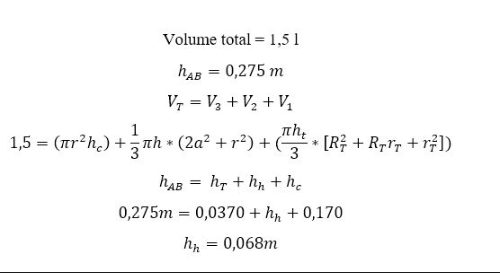
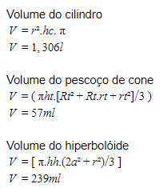

# *Campus* Florianópolis

Departamento Acadêmico de Eletrônica

Curso de Engenharia Eletrônica

Projeto Integrador II

Thiago Lira & Otávio Freire

1. Introdução

Cada vez mais deixamos de assistir e acompanhar a filmes relacionados a revolução industrial e nos tornamos protagonistas dos nossos filmes dentro de fábricas e empresas. Assim, a mudança está ocorrendo no processo produtivo e elaborativo visando facilitar a união das máquinas com os seres humanos, minimizando desgastes indesejados. Além disso, a transformação não está caminhando somente dentro das fábricas. A vida do consumidor mudará até nas pequenas coisas do seu dia a dia.

A indústria 4.0 é marcado pela integração das tecnologias, análise de dados e a customização. As palavras como Big Data, inteligência artificial, IoT, impressão 3D, realidade virtual e aumentada, e cibersegurança. Cada vez estamos repletos de sensores e sistemas de controle operacional sofisticado, comunicando de forma remota.

O foco da indústria 4.0 é a utilização de tecnologia em muitos ramos dentro de um chão de fábrica para auxiliar e melhorar a produção da empresa, sendo por tempo de serviço do funcionário, aumento de produção ou eficiência da produção da empresa em questão. Isso gera um ciclo de renovação das empresas, fazendo obrigatoriamente que caminhem com a evolução do mundo, ou seja, quem não caminha com a tecnologia, com certeza, ficará atrasado. Quando uma empresa continua caminhando para sua evolução todos ganham, além de que a tendência atualmente no Brasil é de evoluir as empresas para o 4.0. Deixaremos cada vez mais de vender produto e começaremos a vender um projeto.

Tornamos cada vez mais adeptos a analisar os dados e identificar tendências, no dia a dia já somo

Desta forma, e analisando a evolução para indústria 4.0 podemos observar que ao reduzir os custos e os tempos se torna maior o aumento e a qualidade do produto e da indústria nacional. Desta forma por meio do Projeto Integrador II buscamos promover a automatização e a telemetria de informações de um ponto de funcionamento operacional que existe em uma empresa de produção em grande escala, para poder avaliar diversos delimitadores tecnológicos para verificação de diversos parâmetros técnicos e grandezas físicas, dentre elas as listadas a seguir com sua tecnologia específica para faz.

2. Concepção (C)
   

​	2.1 Requisitos de projeto

​		Foi proposto no projeto acadêmico a imersão no conhecimento da indústria 4.0 para desenvolvimento de uma ponto de operação. Onde neste ponto de operação será realizado etapas de projeto para leitura de dados em tempo real, análise e resposta dos parâmetros observados. Como consta abaixo, necessita atender aos requisitos de projeto, sendo eles:

- Verificação de rotulagem.
- Controle de nível de envase.
- Leitura OCR de lote e validade.
- Análise de cores de matéria prima.
- Inspeção e testes.
- Análise de temperatura.
- Apresentação de resultados.
- Verificação das etapas de produção.

​		Devido a estes requisitos, o projeto em si consta a leitura de diversos sensores em uma garrafa de vidro em cima de um tablado, em diversos pontos de leitura de dados, operando com comunicação de dados via bluetooth.		

| **Delimitadores Tecnológicos**     | **Tecnologias**              | **Quantidade(s)** |
| ---------------------------------- | ---------------------------- | ----------------- |
| Verificação de rotulagem           | Sensor SR-600ha (em análise) | 1                 |
| Controle de nível de envase        | Sensor JSN-SR04              | 1                 |
| Análise de cores de matéria prima  | Sensor TCS230                | 1                 |
| Leitura OCR                        | Celular com Scam + NewOCR    | 0                 |
| Inspeção e testes                  | GY906 (temperatura)          | 1                 |
| Anáise de temperatura              | Sensor MLX90614              | 1                 |
| Apresentação de resultados         | Display 16x2 + I2C           | 1                 |
| Verificação das etapas de produção | Sensor de presença TCRT5000  | 4                 |

​			Quadro 1: Delimitadores Tecnológicos *versus* Tecnologias. - (em "estoque").

​	2.2 Compreender o projeto

​		Não foi possível utilizar o sensor conhecido no LPAE **HCSR04** por não ter o tamanho ideal para a conciliação com o projeto, pois a entrada da garrafa tem 0,0315m de diâmetro, onde para a utilização do sensor necessita ter o diâmetro superior à 0,050m. Novas medições foram realizadas com paquímetro e foi observado que o sensor ideal para utilização é o **JSN-SR04T**, pois o diâmetro do sensor é de 0,022m.

​		Observações foram feitas em sua operação e no entanto se encontrou diferente do material de apoio referente no LPAE, pois após inúmeras medidas realizadas foi observado que medições inferiores a 30cm de distância do objeto a ser analisado apresenta diversas incoerências no resultado, podendo apresentar diversas vezes o valor 0 “zero” como resposta.

​		Em relação ao sensor **TCS230** (sensor de cor) foi vinculado ao sensor um led RGB para poder mostrar a cor que o sensor consegue entender, no entanto apresentou controvérsia no sinal, por ter grande influência da luminosidade do ambiente de teste. Para obter uma melhora na informação apresentada foi configurada um fator de ajuste luminoso. E para apresentar um cartel maior de valores de cores está sendo configurado um catálogo de cores e um software android para comunicação com o arduino.

​		Com a temperatura sendo lida pelo sensor **MLX90614** podemos observar que somente adicionando sua biblioteca e com poucas linhas de código para apresentar a medição podemos observar a temperatura, além de uma gigantesca vantagem de ter em sua arquitetura devido a sua comunicação ter o barramento **I2C**.

​		O **display 16x2** com o barramento **I2C** anexado mostra ser difícil sua configuração no arduino devido sua biblioteca na WEB se encontrar diversas vezes corrompida para download.

​		Foi escolhido o sensor de presença **TCRT5000** para utilização no projeto por alguns critérios principais, dentre eles por conter uma grande quantidade em estoque no laboratório de apoio (LPAE). Devido também a ter uma biblioteca acessível, e fazer comunicação **SPA**, atendendo os critérios de projeto e todos os parâmetros a serem observados, de acordo com o tablado a ser utilizado o sensor se encontra ideal.

​	2.3 Equação  do projeto

​								*Figura 1: Cálculo da altura por etapas* 

Podemos observar através da Figura 1 e de Figura 2 que foi dividido partes da garrafa de acordo com sua forma geométrica, sabemos que com esses dados anotados obtivemos o valor da altura e do volume aproximado devido a ter valores de incertezas nas medições, seguindo assim.

Foi divido a altura da garrafa em 3 partes para medições e após isso cálculos, sendo elas:

**Hab** = Altura total da garrafa

**Ht** = Altura do Tronco de cone

**Hh** = Altura da hiperboloide de 1 face

**hc** = Altura do cilindro "reto"

​								Figura 2: Medições em paquímetro.

​								Figura 3: Calculo do volume por etapas

Observando assim que a somatória total de todas as 3 divisões do corpo que constitui o objeto em análise podemos observar que o volume total chega a ser de aproximadamente 1,602L. Com esta informação fica mais evidente que o conteúdo no rótulo de 1,5L não pode ultrapassar o pescoço troco de cone. 

Com as informações obtidas de altura para cada parte do projeto 

3. Design (D)

​	3.1 Representação esquemático

​		

​								*Figura 4: Esquemático teste* 

​	3.2 Planta eletrônica (circuito; propósito; projetista; organização e data).

​			

​	3.3 Especificar, quantificar e orçar tecnologias e componentes.			

| Nome da tecnologia | Descrição da tecnologia | Quantidade | Custo: | Cedido por:  |
| ------------------ | ----------------------- | ---------- | ------ | ------------ |
| Arduino UNO        | Processador do projeto  | 1          | X      | 59,90        |
| TCS230             | Sensor de cor           | 1          | Cedido | LPAE         |
| MLX90614           | Sensor de Temperatura   | 1          | Cedido | LPAE         |
| TCRT5000           | Sensor de presença      | 4          | Cedido | LPAE         |
| Display + I2C      | 16x2                    | 1          | Cedido | LPAE         |
| HC-05              | Módulo Bluetooth        | 1          | X      | 36,90        |
| JSN - SR04T        | Sensor de distância     | 1          | Cedido | LPAE         |
| Resistor 2K2       | Limitador de corrente   | 4          | Cedido | Almoxarifado |

​	3.4 Documentar resultados (Arduino)

No testes de evolução do código implantado em Arduino observamos que o código implantado se encontrou maior que o esperado somente com a união dos sensores de: cor; temperatura e o display, onde observamos que o código está com 54% da capacidade total do Arduino, onde observamos que poderemos trocar o Arduino do uno para o mega, onde o código cai para valores ideias de processo. 

  

​								*Figura 5: Código Arduino teste* 

4. Implementar (I)

   ​	4.1  Modelar elementos para ser possível fazer verificações e medidas, mediante o uso de recursos tecnológicos

   ​		

   ​			Nesta etapa de projeto foi verificado que como os sensores estariam em sua grande maioria na parte superior da garrafa para atender os critérios de projeto em um setor empresarial de produção, foi necessário compensar a utilização de fios de ligação com fios disponibilizados pelo Almoxarifado do IFSC - Florianópolis de cabo de rede, onde a interligação dos terminais dos sensores com os fios foi feita por estanho, e a interligação dos cabos de rede com os sensores foi necessário conectar através de solda um jumper que em relação ao cabo de rede tem uma ligação mais segura com o arduino em sí. Evitando maiores chances de mal contato dos terminais e danificando o circuito integrado dos sensores com o arduino e protoboard.

   

   ​	4.2   Elaborar os algoritmos necessários ao atendimento dos requisitos para o projeto

   ​			

   ​			Através da análise de que os sensores deveriam atender os critérios de setor de produção empresarial, foi destacado a operação dos sensores através da autorização do sensor de presença 

   **TCRT5000T** por meio de interrupção, onde quando verificado a interrupção do sensor faria a verificação da região solicitada, e somente mostraria a informação no **display I2C** através desta interrupção. Como visamos a operação empresarial foi destacado assim:

   

   

   

   Sensor RGB - Mostra a cor do líquido 

   ​				Se o **TCS230** fosse mostrado uma cor de vinho ou roxo mostrava "produto válido".

   ​				Se o **TCS230** fosse mostrado uma cor levemente diferente de vinho ou roxo, como vermelho ou lilás mostrava "revisar ".

   ​				Se o **TCS230** fosse apresentado uma cor totalmente disturbada do vinho ou roxo mostrava "inválido".

   

   Sensor de altura - Mostrava o volume do líquido

   ​				Se o **JSN - SR04T** fosse mostrado uma altura inferior ao de 25 cm do líquido e 27 cm do líquido  em relação a base da garrafa mostrada "produto inválido" devido a 1,5L estar em torno da área de tronco de cone da garrafa. Por esta razão, diversos ajustes foram feitos para conseguir colocar o sensor de distância exatamente perfeitamente no diâmetro da boca da garrafa, para leitura do seu volume, por dias foi difícil ajustar, pois pegava a boca da garrafa.

   ​				

   

   Sensor de Temperatura - Mostrava a temperatura do liquido

   ​				No **GY-906**  foi mais ideal usa-lo já que o líquido suporta bastante variações de temperatura, e nessa questão foi monitorado somente a temperatura externa, e a temperatura interna do líquido.

   ​			

   5. Operação (O)

      ​	

      ​	Nesta parte de operação novamente leves ajustes foram feitos para mantermos o sensores nivelados e a marcações no tablado foram realizados para delimitar a área de atuação de cada sensor, ajustes no sensor de presença foram feitos pois quanto mais próximo o sensor de presença, mais idealmente a análise e a interrupção do sistema para verificação do ponto se torna.

Todas as informações do projeto são de direito de Thiago Lira e Otávio Freire.

