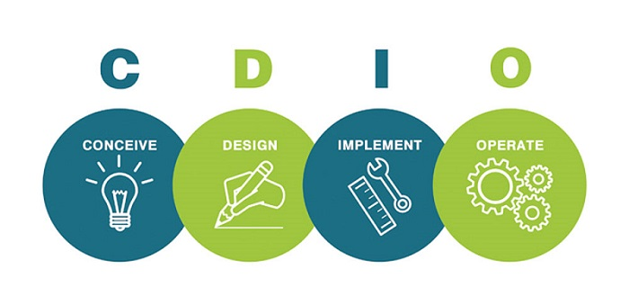
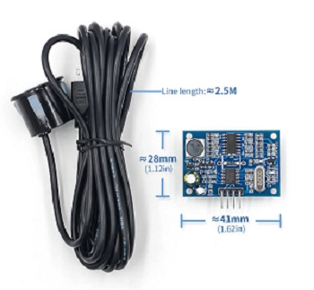
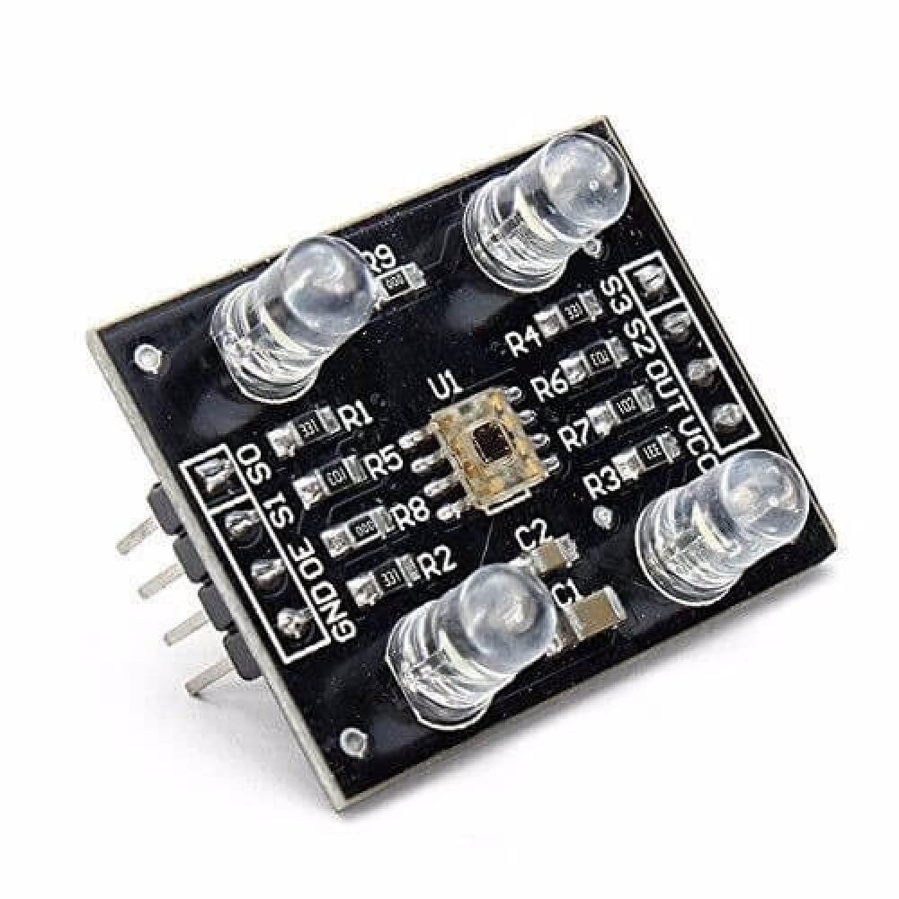
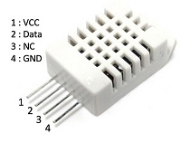
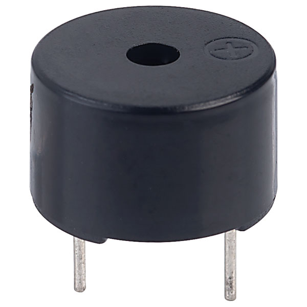
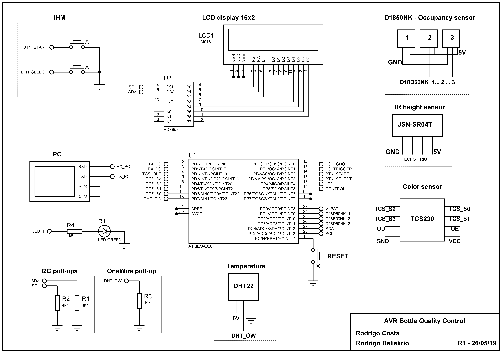
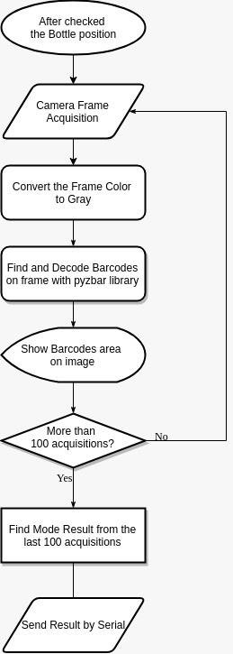

# Projeto Integrador II - Engenharia Eletrônica

# Controle de produção de uma garrafa de suco de uva
###### *Rodrigo Belisário Ramos*
###### *Rodrigo Luiz da Costa*
# Projeto Bottle Quality Control (BQC)  
  Desenvolvimento de um sistema microcontrolado e uma interface de software para controle e monitoramento do processo de produção de uma garrafa de suco de uva da marca "Gran Legado", com objetivo de obter as seguintes informações:
  ###### Altura do líquido envasado
  ###### Cor do líquido envasado
  ###### Temperatura ambiente durante processo de produção
  ###### Umidade relativa do ar ambiente durante processo de produção
  ###### Código de barras do produto
  ###### Tipo do código de barras
  ###### Registro MAPA do produto
  ###### Status de aprovação da garrafa  
## INDÚSTRIA 4.0
  Atualmente vivenciamos a quarta Revolução Industrial. As novas tecnologias desenvolvidas, permitem que máquinas executem novas funcionalidades devido à sua conectividade à rede e maior facilidade no acesso às informações, alterando significativamente o nosso dia a dia.  
Neste contexto, novos modelos de negócios, processos de trabalho e métodos de desenvolvimento que eram inimagináveis estão surgindo. Essas mudanças influenciarão fortemente os hábitos sociais e as perspectivas de mercado. (JAZDI, 2014).
  Para se adequarem à estas mudanças, as grandes empresas de tecnologia estão se atualizando às novas perspectivas e demandas do mercado, segundo a empresa Bosch (2014), a Indústria 4.0 permite que dispositivos, equipamentos e peças troquem informações que serão processadas na nuvem, tornando-se requisito fundamental em máquinas e interfaces conectadas à rede.  
  Não obstante, a Legrand, líder mundial em equipamentos para o setor elétrico, divulgou que de 2014 a 2017 houve um crescimento de 28% na venda de produtos interconectados (IoT), gerando uma receita de 488 milhões de euros nesse período, evidenciando cada vez mais o aumento na demanda e procura por soluções interconectadas.  
  Por estes motivos, a execução do controle automatizado de processos de produção industrial utilizando plataforma interconectadas é requisito fundamental. Este documento visa descrever as etapas de desenvolvimento desta interface.

## **CONCEPÇÃO**
​	O processo de controle industrial  automatizado irá monitorar 4 etapas do processo do produção de uma garrafa de 1.5L de suco de uva.
​	O processo projetado será sequencial, na ordem descrita pelos requisitos abaixo:

###### 	**Requisito funcional 1 - Análise da altura do líquido**
​	Será utilizado um suporte afixado de maneira que fique 20cm em cima da parte superior da garrafa (distância mínima de aquisição do sensor), que estará com a tampa aberta no momento da análise.
​	Para o monitoramento da grandeza, será utilizado o sensor ultrassônico JSN-SR04T. 
-><-  
Projeta-se a a utilização de uma webcam para o processamento de imagem para cálculo do volume em função da altura do líquido.  

###### 	**Requisito funcional 2 - Análise da coloração do líquido**
​	Para monitoramento da coloração do líquido da matéria prima será utilizado o sensor de cores RGB TCS3200.  
Projetou-se uma calibração prévia com o líquido ideal, para armazenar os valores de comparação e margem de erro para o líquido ideal a ser aprovado no processo de produção.
-><-  

###### 	**Requisito funcional 3 - Verificação de rotulagem**	
​	Para a verificação de rotulagem, será utilizado uma Webcam C920 utilizando a biblioteca OpenCV para processamento de imagem e verificação da angulação do rótulo para analisar se foi posto e se foi disposto corretamente (angulação). Também será utilizado um algoritmo de detecção de código barras par obter os parâmetros gerais do produto, que são: país de fabricação, número da empresa e número do produto. A análise do código de barras é feita utilizando o seguinte fluxo de processos.

###### 	**Requisito funcional 4 - Leitura OCR** 
​	Para a leitura OCR das grandezas, será utilizado uma Webcam C920 utilizando a biblioteca OpenCV para processamento de imagem, identificando os parâmetros de, lote, validade e local de produção utilizando os caracteres disponíveis no registro mapa. 

###### 	**Requisito opcionais** **Temperatura/Umidade**
​	Sensores de presença IR E18-D80NJ para os três estágios de produção, possibilitando um processo sequencial sem falhas de inserção.
​	Monitoramento de temperatura e umidade com o sensor DHT22.
-><-
​	Indicação sonora de estágio concluído por atuador sonoro, que será um buzzer com oscilador interno.
-><-

## DESIGN
    Para a visualização do sistema em blocos funcionais, desenvolveu-se uma planta eletrônica contendo todos os blocos presentes no sistema implementado. A planta eletrônica do projeto "Bottle Quality Control" pode ser vista em seguida:
    
    Para a implementação do processamento de imagem que fará a aquisição do código de barras a partir da imagem gravada pelo webcam do dispositivo, projetou-se o seguinte fluxograma:  
    

## IMPLEMENTAÇÃO  
Implementou-se um software para controle e monitoramento do processo de produção: "BQC GUI" (Bottle Quality Control Guided User Interface" 
#### Altura
#### Código de barras
Resultado da leitura do código de barras no BQC GUI
-><-
#### e

## OPERACIONALIZAÇÃO
Por fim, fez-se os ajustes funcionais no software de controle de produção BQC GUI e obteve-se o seguinte resultado de interface:

## REFERÊNCIAS
JAZDI, N. **Cyber physical systems in the context of Industry 4.0**. 2014 IEEE International Conference on Automation, Quality and Testing, Robotics. DOI: 10.1109/AQTR.2014.6857843. IEE, 2014.  
BOSCH. **Industry 4.0.** Disponível em: https://www.bosch.com/stories/industry-for-individualists/. Acesso em 18/02/2019.  
LEGRAND. **The Eliot Program**. Disponível em: <https://www.legrand.com/en/group/eliot-legrands-connected-objects-program>. Acesso em 20/03/2019.
