# Projeto Integrador 2 - 2019/1

Instituto Federal de Santa Catarina - *Campus* Florianópolis
Departamento Acadêmico de Eletrônica
Curso de Engenharia Eletrônica
Aluno: 
* Vítor Faccio - <vitorfaccio.ifsc@gmail.com>

Professores: 
* Fernando Miranda - <fernando.miranda@ifsc.edu.br>
* Luís Azevedo - <azevedo@ifsc.edu.br>

# Introdução
De acordo com o dicionário Michaelis, o termo “revolução” pode ser descrito como uma mudança profunda em algum ambiente ou sistema. Desta forma, conforme Branco (s.d.i.), caracterizam-se respectivamente as três revoluções industriais datadas nos séculos XVIII, XIX e XX: a invenção da máquina a vapor e sua inserção na manufatura têxtil, a aplicação da eletricidade nas indústrias e a integração entre ciência e produção.

As inovações do século XXI estão protagonizando uma quarta revolução industrial e tecnológica, que já é reconhecida globalmente no campo acadêmico e econômico. A “Indústria 4.0”, como pode ser chamado o novo patamar tecnológico, se difere das outras pela convergência entre os mundos físico, digital e biológico no âmbito industrial mas também escapando para o cotidiano das cidades. 

Destaca-se neste ambiente a robótica, o trânsito de dados, a comunicação entre equipamentos e a inteligência artificial. O aprimoramento das indústrias atuais requer a eliminação de ociosidade e disperdícios, o que flerta com o desenvolvimento de máquinas inteligentes. A informatização do chão de fábrica é capaz de tornar todo o processo de fabricação um ciclo controlado e otimizado, abrindo ainda espaço para a comunicação das máquinas com seres humanos e a redução de custos. 

Neste sentido é necessário haver uma boa base de armazenamento remoto de dados, possibilitando assim uma troca de informações rápida e eficiente com os mais diversos aparelhos. O armazenamento em nuvem surge ao lado da inteligência artificial como campo de desenvolvimento para a independência das máquinas na indústria, de forma que não seja mais pertinente uma mão humana controlando e tomando decisões.

A indústria 4.0 já possui relevância mundial: o Fórum Econômico Mundial, evento onde são tratados os rumos das grandes potências empresariais e governamentais do mundo, discute a presença destas inovações tecnológicas no futuro da economia mundial. O Fórum (2016) apresenta uma série de recomendações a líderes industrais para a adequação digital, como a criação de modelos de negócio digitais, digitalização dos planos estratégicos, aproveitamento de dados e integração da automação à força de trabalho. Mais tarde, o Fórum cita (2017) as 10 tecnologias mais emergentes do ano: todas se envolvem com o desenvolvimento de pesquisa e produção, mas três se relacionam especificamente com a eletrônica e a indústria 4.0, como a interação entre equipamentos na lavoura para gerar safras com mais precisão.

Tendo em vista o cenário de evolução dos sistemas tecnológicos e a necessidade de se adaptar o aprendizado às futuras vivências do profissional, este projeto possui enfoque na interconectividade de aparelhos aplicáveis em uma indústria 4.0. Será abordado o ambiente industrial de forma simulada, para que o aluno proponha, desenvolva e implante sobre ele tecnologias para a resolução do problema proposto. 

# Proposta
Este projeto visa o domínio e a compreensão de técnicas de projeto na engenharia eletrônica, abordando diversos aspectos da criação de um produto. A proposta se dá em torno da linha de produção de uma garrafa de suco de uva, de forma que se obtenha ao fim do semestre um sistema capaz de agir como captador de dados e aplicável em uma indústria real. É tido como foco dos estudos a organização do projeto em quatro níveis:
1. Concepção
    * Definir as necessidades do cliente
    * Considerar tecnologias, estratégias e regulamentações
    * Desenvolver conceitos, técnicas e planos
2. Design
    * Plantas, desenhos e algoritmos que descrevem o que será implementado
3. Implementação
    * Transformação do design em produto
    * Manufatura, escrita de códigos, testes e validações
4. Operação
    * Utilizar o produto implementado para a entrega do serviço definido
    * Manutenção, evolução e recolhimento do sistema

Tendo isso em vista, é dado início à etapa de concepção do projeto.

# Concepção
O estágio de concepção serve como momento para o projetista conhecer o ambiente e os objetivos de seu cliente, bem como pré-requisitos e limitações. Desta forma a primeira tarefa realizada é a definição dos pré-requisitos, que devem ser implantados ou apresentados como soluções ao fim do processo. 

O ambiente industrial deve ser simulado em uma mini-bancada de madeira, onde serão inseridos os componentes do projeto para que se tenha um ambiente semelhante ao de uma fábrica, evitando as mazelas de uma esteira elétrica. Sobre esta plataforma serão implantados blocos para a realização das seguintes tarefas:
1. Verificação de rotulagem
2. Controle de nível de envase
3. Análise de cores de matéria-prima
4. Leitura OCR (*Optical Character Recognition*) de lote e validade
5. Inspeção e testes

A seguir é feita a análise e definição de tecnologias a serem empregadas em cada ponto. As limitações laboratoriais regem as decisões agora tomadas, pois a empregabilidade do produto final depende de disponibilidade e preço dos equipamentos a serem utilizados. As tecnologias empregadas neste projeto serão descritas a seguir. 

## Tecnologias empregadas
Os cinco blocos citados serão desenvolvidos  com  as seguintes tecnologias e equipamentos:
* Controle de nível de envase
	* Sensor de distância por ultrassom JSN-SR04T ligado a Arduino
	* Obtenção de altura do líquido por ultrassom através do bocal da garrafa
	* Criação de escala para relacionar altura e volume
	* Sensor funciona com emissor e receptor de onda em apenas um microfone, o que possibilita a detecção através do bocal estreito
* Análise de cores de matéria-prima
	* Sensor de cor TCS230 ligado a Arduino
	* Obtenção de componentes RGB (vermelho, verde e azul) da superfície analisada
	* Interpretação dos dados e cálculo da cor resultante por conta do Arduino
* Inspeção e testes
	* Controle de temperatura do produto - fator chave na produção de alimentos e bebidas
	* Sensor de temperatura por infravermelho MLX90614 ligado a Arduino
	* Medição da temperatura sem necessitar de contato com o objeto, permitindo mais liberdade de movimentação
* Verificação de rotulagem / Leitura OCR de lote e validade
	* União dos dois estágios para utilização de apenas uma câmera
	* *Webcam* ligada ao *notebook*
	* Processamento de imagem por Python
	* Uso de tecnologia Tesseract OCR para reconhecimento de caracteres do rótulo e de lote e validade
	* Estágio em avaliação de estruturas

As tecnologias envolvidas com a estrutura do projeto, que garantem o funcionamento e a comunicação destes blocos, devem seguir a possibilidade de serem transportadas a uma planta industrial, supondo a substituição de uma plataforma modelo por uma real. Desta forma, elas são definidas como as seguintes:
* Um Arduino Uno para controle dos sensores e comunicação
* Um sensor de presença por infravermelho TCRT5000 em cada estágio do processo
* Arduino e *notebook* conectados via Bluetooth
	* Módulo HC-05 ligado ao Arduino
	* Leitura do Bluetooth por parte do *notebook*
* Implementação de interface gráfica para manipulação do programa em Pythin
* Estrutura física:
	* Impressão 3D de alças para a bancada
	* Manufatura de peças em madeira para fixação dos sensores

Os equipamentos e métodos propostos acima envolvem-se com a obtenção e o processamento de dados, procedimentos indispensáveis em uma linha de produção. A intercomunicação do Arduino com o *notebook* e a utilização de softwares programáveis abrem espaço para a ampliação do sistema na quantidade de sensores e aplicabilidade, o que vai ao encontro do plano da Indústria 4.0.

# Design

A seção de *design* inicia-se com o resgate e a adaptação dos códigos necessários para o funcionamento dos sensores sobre o Arduino, além de conhecer seus esquemas de ligação. Todos os códigos que relacionam sensores ao Arduino são escritos na linguagem C++.

## Sensor de distância por ultrassom
O sensor utilizado, JSN-SR04T, possui apenas 1 microfone e permite a medição através de locais estreitos. Sua faixa de funcionamento parte de 20 cm e sua operação é idêntica à do sensor HC-SR04, medidor muito mais comum mas inapropriado por possuir dois microfones. O código base obtido é próprio do segundo equipamento, mas devido às semelhanças entre os dois é possível utilizá-lo para controlar o primeiro. 

O código está disponível na sessão de Anexos e foi obtido no tutorial de funcionamento do sensor HC-SR04 com Arduino do *site* "Filipeflop", escrito por Adilson Thomsen (2011). A seguir observa-se a figura 1, que ilustra as ligações do sensor para este exemplo.

Figura 1 - Esquemático base do sensor HC-SR04
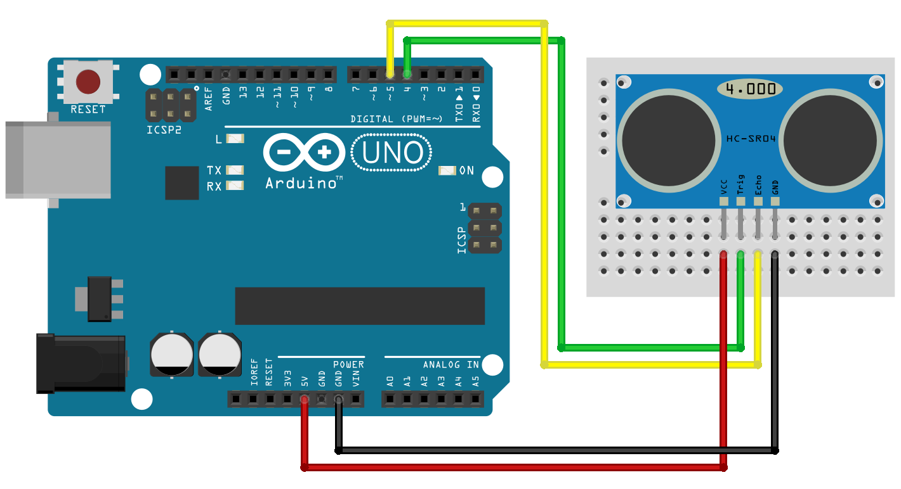

A maneira de se medir o nível de envase é ilustrada na figura 2, onde são mostradas três grandezas de distância: h_sensor, d_sensor-líquido e h_líquido. A altura h_sensor é fixa, estando o sensor preso a um suporte, enquanto a distância d_sensor-líquido depende do nível de envase e consequentemente é capaz de informar a quantidade de líquido dentro da garrafa. 

Figura 2 - Diagrama de medição com o sensor JSN-SR04T
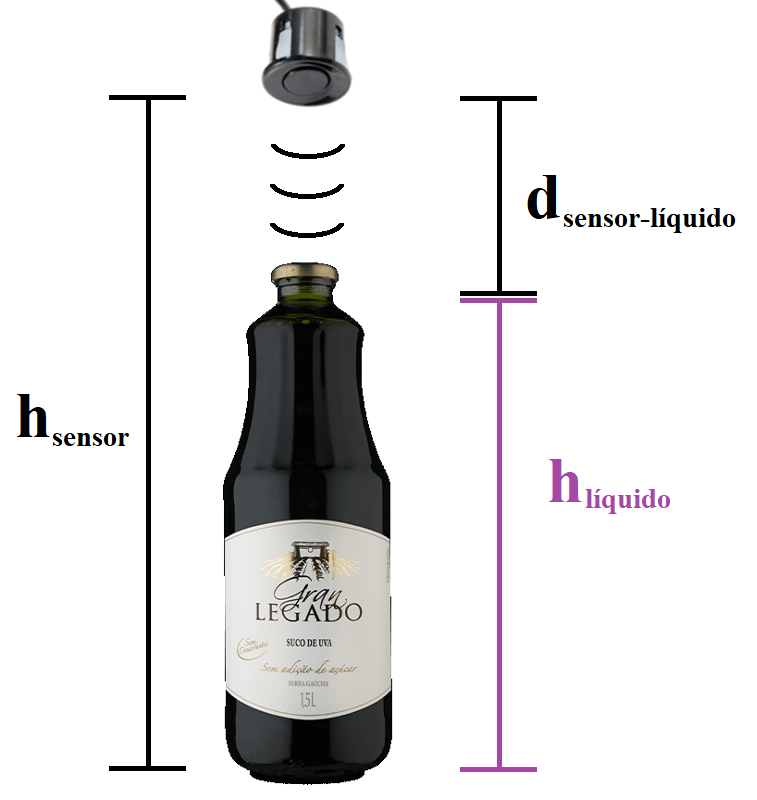

## Sensor de cor
O sensor de cor TCS230 é facilmente implementável no Arduino e conta com código base pronto, obtido por meio do site "Arduino e Cia" (2014), que se encontra nos Anexos. Seu esquemático está disposto na figura 3.

Figura 3 - esquemático base do sensor TCS230


## Sensor de temperatura por infravermelho
Obtido por meio do site "Arduino e Cia" (2019), o código base para implementação do sensor de temperatura é disponibilizado em anexo e seu esquemático está ilustrado na figura 4. 

Figura 4 - Esquemático base do sensor MLX90614
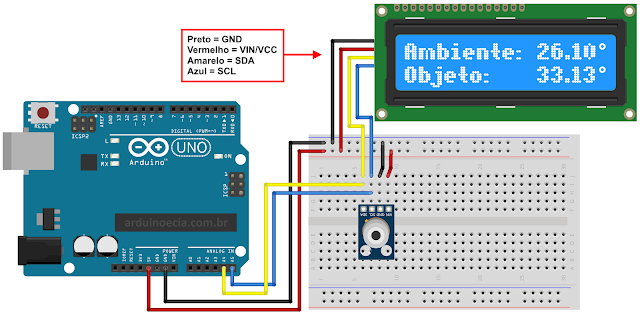

## Sensor de presença por infravermelho
A implementação do sensor de presença é muito simples, requerindo um código curto e poucos componentes para o acionamento do equipamento. Seu código (em anexo) implementa o controle de um LED em função do estado do sensor, tendo ou não um objeto na frente de suas lentes. A figura 5 ilustra sua montagem.

Figura 5 - Esquemático base do sensor TCRT5000


## Módulo Bluetooth
Os dados obtidos no sensoreamento devem ser enviados para o *notebook* utilizado a fim de integrá-los à etapa de verificação de imagem. Está disponível publicamente um exemplo de controle de luz com Python e Arduino, escrito por Noah Huber-Feely (2016), que aborda os códigos dos dois equipamentos. Ambos estão descritos em anexo.

Há um ponto que deve ser cuidado: o módulo Bluetooth trabalha com tensão de 3,3 V, enquanto as portas do Arduino emitem 5 V. A figura 6, obtida no site "Filipeflop" (2015), apresenta uma solução simples: um mero divisor resistivo no pino RX do dispositivo.

Figura 6 - Adaptação de nível de tensão para o módulo HC-05


## Reconhecimento de imagem
A etapa de reconhecimento de imagem tem suas bases divididas em duas partes: a obtenção da imagem da câmera e o reconhecimento em si; para cada uma recorreu-se a uma fonte distinta, mas elas foram estudadas e testadas conjuntamente.

A seção de recuperação da imagem por câmera foi escrita com base em funções da biblioteca OpenCV.

A mesma biblioteca conta com funções de processamento de imagem, que são requeridas na etapa de leitura OCR. O texto utilizado como base para esta parte foi escrito por Ronal Rodrigues (2017) e explica os diversos pontos necessários para a atividade. Em anexo é apresentado o código final de seu exemplo. A imagem da câmera deve substituir a leitura do arquivo 'saoluis.jpg' na oitava linha.

Após ser feita a leitura das informações contidas na imagem, todos os dados requeridos do processo estão prontos e podem ser finalizados expondo-os ao usuário.

## Disponibilidade de pinos no Arduino
Todos os sensores a serem ligados no Arduino requerem pinos para haver a comunicação. Os pinos de alimentação e terra não precisam ser contabilizados pois podem compartilhar de uma mesma saída da placa, mas deve se ter em vista todos os que requeiram saídas digitais ou analógicas. Desta forma, é feita a análise:

  Tipo de sensor ou dispositivo | Quantidade de pinos necessários
  -------------  | -------------
  Distância      | 2 
  Cor            | 5 
  Temperatura    | 2 (Analógicos) 
  Presença (x2)  | 2
  Bluetooth | 2

Estes valores estão adequados ao uso em um Arduino Uno.

## Planta resultante

A união dos diversos dispositivos ao Arduino deve resultar em um esquema relativamente complexo de ligações, tendo em vista que estes não estão mais isolados como anteriormente. Neste sentido a figura 7 ilustra o esquema definido para ligar todos os pinos dos sensores. Determinou-se que todas as medições do Arduino fossem tomadas com a garrafa em uma mesma posição, logo foram necessários apenas dois sensores de presença.

Na imagem os sensores são exibidos na seguinte sequência, partindo da região superior:
- Dois sensores de presença TCRT5000
- Sensor de distância representado pela figura do HC-SR04
- Sensor de cor TCS230
- Sensor de temperatura MLX90614
- Módulo Bluetooth HC-05

Figura 7 - Planta final do Arduino
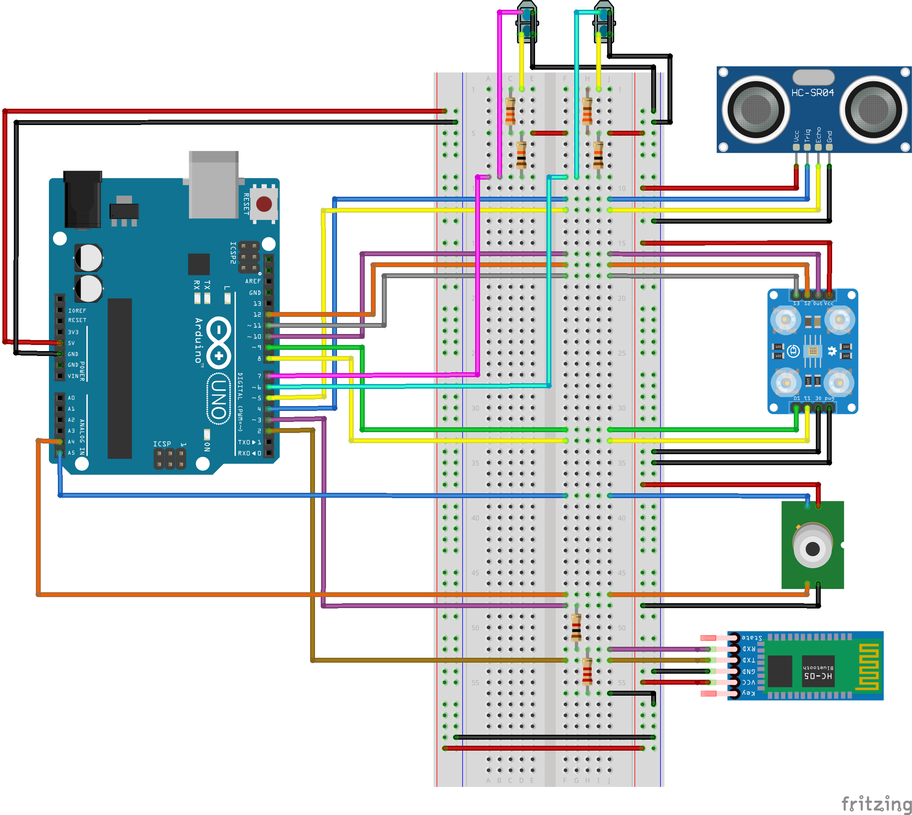

# Implementação

A escrita dos códigos de Arduino e Python para unir todo o processo foi feita admitindo-se um protocolo de comunicação simples e próprio do aluno, com envios de caracteres para sincronizar as etapas, mas utilizando as funções vistas nos exemplos anteriores para lidar com os sensores. 

Os últimos dois códigos da sessão de Anexos mostram os dois citados respectivamente. O em C++ põe à vista o uso de funções próprias como *get_dist()*, que utiliza a função de obter o valor do sensor de distância para retirar uma média de várias amostras - isto foi necessário após se constatar a alta variabilidade dos resultados em situações estáticas, o que acarretaria em sérios problemas no controle do produto. 

O código para o *notebook* foi altamente voltado ao gerenciamento da interface gráfica, gerada a partir do pacote PyQt5. A programação orientada a objetos mostrou ser um problema ao longo do desenvolvimento do programa, além de também ser necessário dominar bibliotecas e estratégias até então desconhecidas pelo autor. Estabeleceu-se uma máquina de estados que transita entre o início do processo por parte do Arduino, o aguardo do envio dos dados, tratamento de imagem e repetição do processo. 

A determinação da presença do rótulo se fez pela identificação das palavras "Suco", "De" e "Uva" na imagem recebida, que estão presentes de forma clara no rótulo. O nome da marca possui fonte desenhada, logo não conseguiu ser reconhecido pelo algoritmo de OCR. Determinou-se um tempo de 10 segundos para que a leitura fosse feita, caso contrário a garrafa é classificada como sem rótulo.

No decorrer dos testes a leitura de lote e validade na tampa metálica tornou-se um empecilho, sendo substituída por uma leitura de código de barras para tornar o projeto factível e manter sua complexidade. 

A montagem do aparato físico foi feita em marcenaria, onde foram montados dois suportes principais para os sensores e a câmera utilizada. As peças individuais são mostradas nas figuras a seguir. Buscou-se manufaturar peças adaptáveis, que pudessem ser reguladas para a melhor posição dos sensores, além de fácil montagem e desmontagem. 

Já possuindo todas as ligações dos sensores com o Arduino, a figura 8 ilustra a bancada utilizada no projeto com os dois conjuntos de suporte e a garrafa de vidro. O estágio mais à direita é responsável pelas medições do Arduino, enquanto o à esquerda recebe a câmera para tratamento de imagem. Nas fotos a seguir a câmera não estava posicionada no lugar devido à sua indisponibilidade momentânea.

Figura 8 - Projeto montado em bancada com suportes e ligações
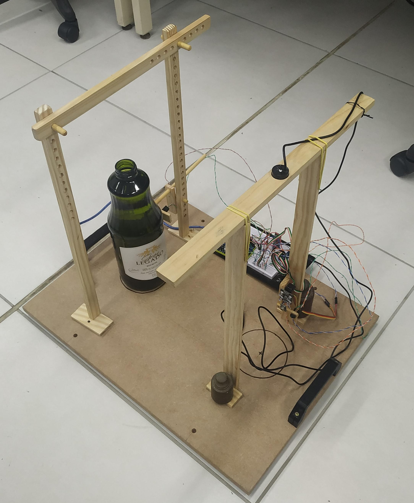

O Arduino e os sensores do primeiro estágio são mostrados em detalhes na figura 9, enquanto o sensor de presença do segundo e seu suporte são vistos com mais clareza na figura 10. 

Figura 9 - Detalhe do Arduino e sensores do primeiro estágio


Figura 10 - Detalhe do sensor de presença do segundo estágio e seu suporte
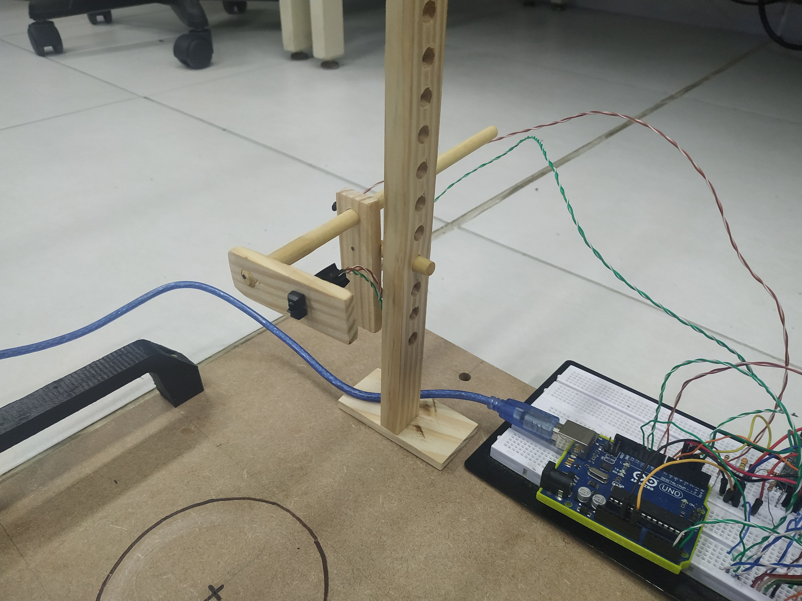

Os sensores do primeiro estágio são explorados nas figuras 11 e 12, onde observa-se respectivamente o sensor de distância, montado na parte superior do suporte, e o agrupamento dos sensores de cor, temperatura e presença.

Figura 10 - Detalhe do sensor de distância
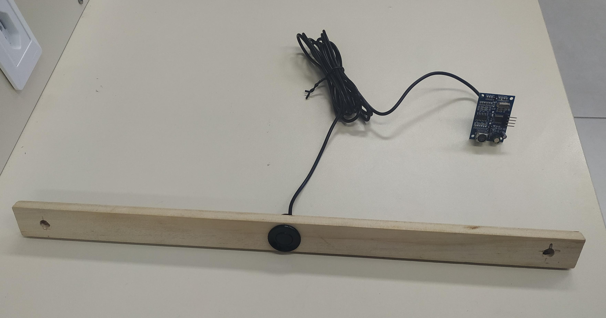

Figura 11 - Detalhe do agrupamento de sensores de cor, temperatura e presença
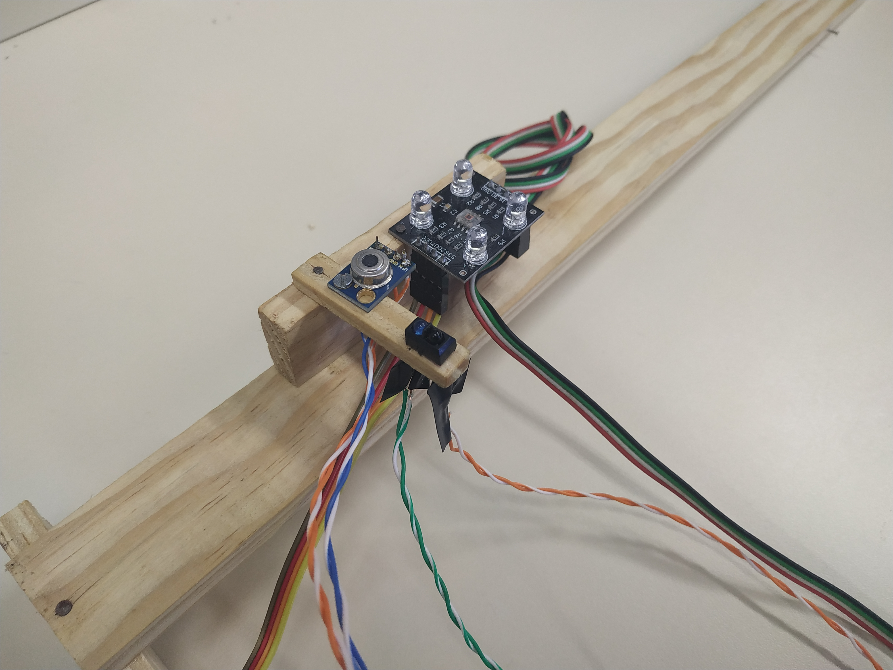

O segundo estágio foi desenvolvido pensando na possibilidade de se alterar a posição da câmera e dos suportes, para que o foco e o enquadramento da foto não se tornem um problema. Para isso os suportes contam com furos espalhados regularmente e pinos de madeira, para que se determine a posição correta da câmera e ela assim permaneça fixa. A figura 12 ilustra estas peças, além do suporte para o sensor de presença - que também pode ser ajustado em altura por meio dos mesmos orifícios.

Figura 12 - Conjunto de suportes do segundo estágio
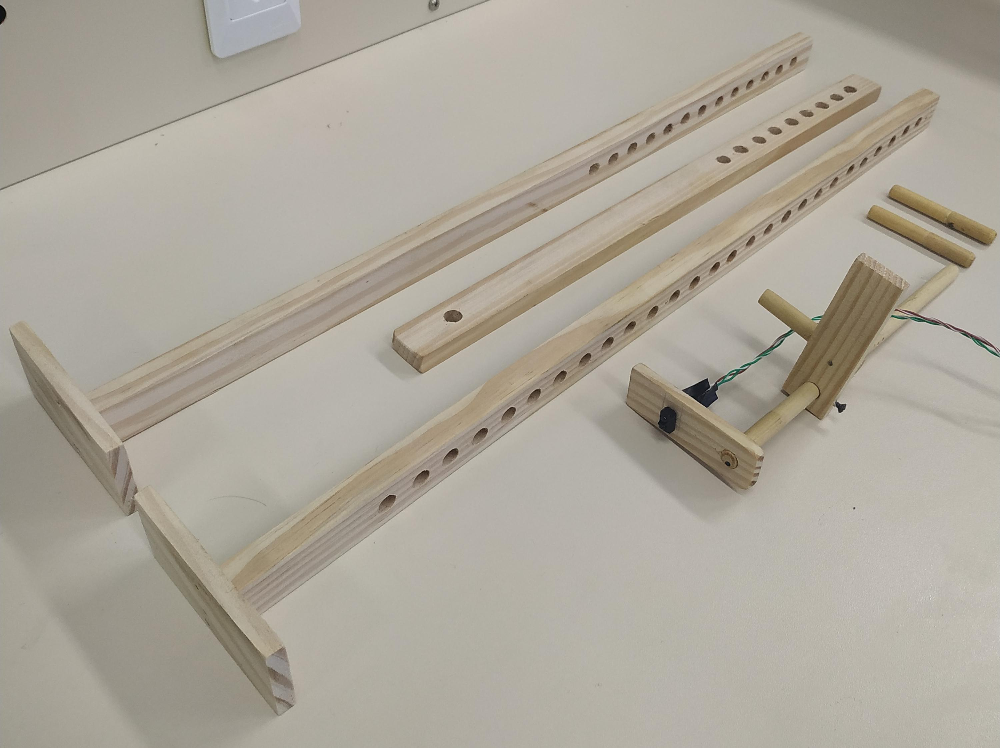

Este suporte para o sensor de presença também é detalhado na figura 13. Ele conta com um ajuste de profundidade, pois a alteração do suporte para adequar-se à câmera não pode levá-lo para longe da garrafa, o que impediria sua correta detecção.

Figura 12 - Suporte do sensor de presença do segundo estágio
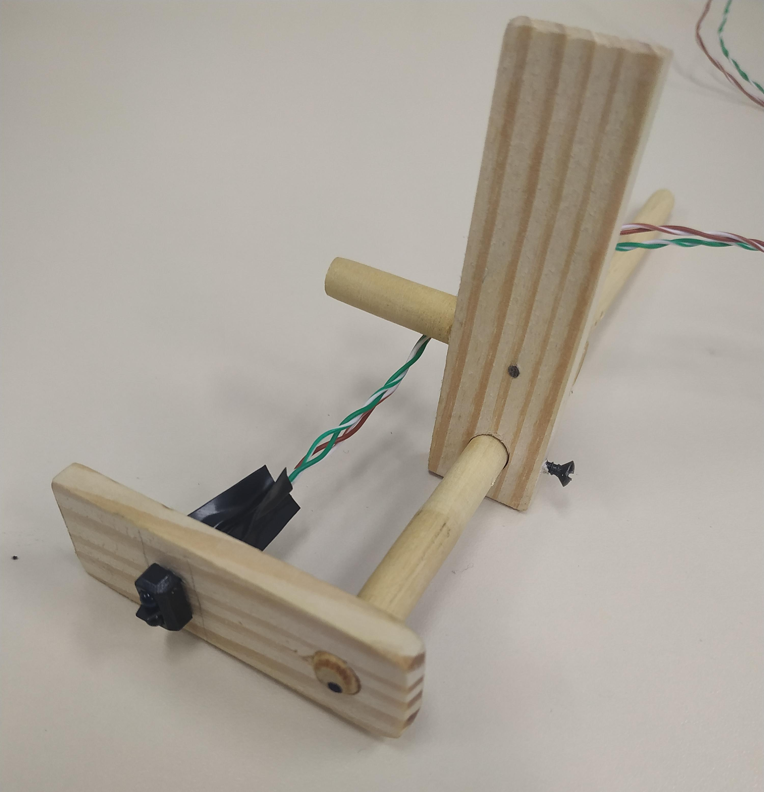

Por fim, a câmera utilizada no projeto é ilustrada na figura 13. Para uma melhor adaptabilidade e independência da bancada, é possível substituí-la por uma com conexão sem fio ao computador.

Figura 13 - Câmera utilizada
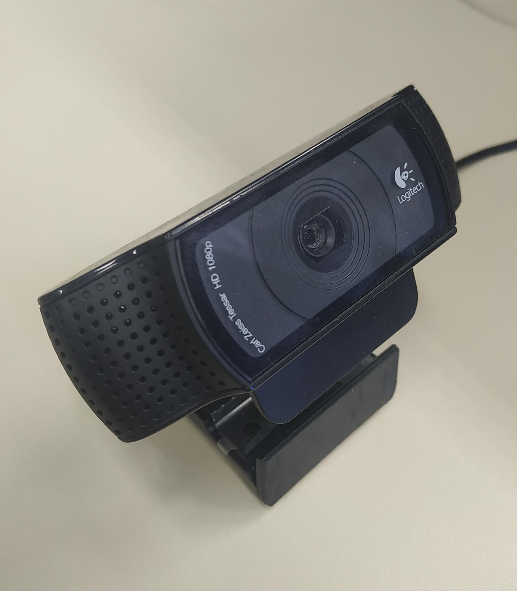

# Operação
2400
A operação do projeto obteve sucesso, realizando as operações de medição e comunicação entre os aparelhos da forma esperada. A figura 14 ilustra o recebimento dos dados de medições no *notebook*, onde observa-se também a janela da interface gráfica com o espaço destinado ao vídeo.

Figura 14 - Resultados das medições mostrados na tela do *notebook*


Em suas etapas, pode se distinguir os comportamentos:
## Medida de volume: 
O sensor ultrassom tem um comportamento variado dependendo do estado da garrafa. Sua resposta não se comportou linearmente em função da altura do líquido, retornando valores muito instáveis quando a garrafa possui menos de 1 L e variando muito pouco perto do limite de 1,5 L. Mesmo assim é possível verificar o correto envase do suco, dado que o sensor é bastante estável quando o volume supera 1,2 L. A tabela a seguir mostra a resposta do sensor em função do volume da garrafa, o que deve ser utilizado para analisar seu envase.

Volume na garrafa (mL) | Altura do líquido (cm) | Valor retornado pelo sensor (microssegundos)
  -------------  | -------------  | -------------
  0	      |  0,5  | 2400 
  200    |  4,1  |1980 
  400    |  7,4  |1660 
  600    | 10,0 |1860 
  800    | 12,7 |1520   
  1000  | 15,3 |1540  
  1100  | 16,7 |1410   
  1200  | 18,4 |1350   
  1300  | 20,3 |1310   
  1350  | 21,6 |1245   
  1400  | 23,2 |1196   
  1450  | 24,8 |1175   
  1500  | 26,5 |1142   

Esta série de dados resulta na dispersão de pontos ilustrada na figura 15, onde o eixo X representa a altura do líquido na garrafa em centímetros e Y é a resposta do sensor em microssegundos.

Figura 15 - Resposta do sensor ultrassom em função da altura do líquido na garrafa
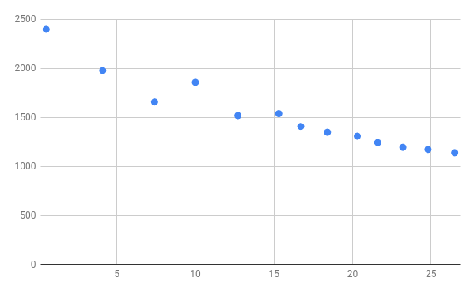

## Medida de cor: 
A escolha do local para dispor o sensor TCS230, lateral à garrafa, resultou em uma medida distorcida devido à cor do vidro. Apesar disso, é possível identificar que o sistema está fazendo sua verificação de forma correta - dentro do panorama dado.

## Medida de temperatura: 
O sensor mede as temperaturas ambiente e da garrafa de forma correta, sem nenhum problema.

## Detecção de presença:
Os dois detectores de presença atuaram com firmeza e facilidade, dando respostas rápidas e precisas. Seu único contratempo foi a não-detecção da superfície de vidro, apenas do rótulo, mas isso não atrapalhou o funcionamento do projeto.

## Comunicação Bluetooth
O protocolo utilizado para sincronizar o envio e recebimento de dados foi de suma importância e possibilitou uma comunicação quase perfeita. O comando do Arduino por parte da interface gráfica, determinando quando deve se iniciar o processo, ajudou na compreensão de como os sistemas se entrelaçam.

No entanto o envio do pacote de dados de um equipamento para outro contou com problemas pontuais, envolvendo caracteres mal lidos pelo computador, o que foi resolvido com facilidade inserindo esperas por confirmação e repetição de envio quando necessário.

## Interface gráfica:
A interface comportou-se totalmente de acordo com o esperado, mostrando a câmera apenas nos momentos de leitura e disponibilizando corretamente os botões e textos devidos. Sua abertura foi rápida e estável, mantendo-se sem contratempos ao longo de todos os testes.

## Leituras de imagem:
Os algoritmos utilizados de abertura de câmera, leitura OCR e leitura de código de barras funcionaram perfeitamente


# Referências bibliográficas
Código base JSN-SR04T-2.0 (distância): https://www.filipeflop.com/blog/sensor-ultrassonico-hc-sr04-ao-arduino/

Código base TCS230 (cor): https://www.arduinoecia.com.br/2014/02/sensor-de-reconhecimento-de-cor-tcs230.html

Código base MLX90614 (temperatura): https://www.arduinoecia.com.br/2019/03/sensor-de-temperatura-mlx90614-arduino.html

Código base TCRT5000 (presença): http://blogmasterwalkershop.com.br/arduino/arduino-utilizando-o-sensor-reflexivo-tcrt5000/

Código base Bluetooth - Arduino e Python: https://create.arduino.cc/projecthub/nhuberfeely/remote-bluetooth-light-control-with-python-8308fc

Lendo imagens - OCR com Google Tesseract e Python:
https://blog.codeexpertslearning.com.br/lendo-imagens-uma-abordagem-%C3%A0-ocr-com-google-tesseract-e-python-ee8e8009f2ab

Utilização de câmera ligada ao notebook com Python: https://gist.github.com/radames/1e7c794842755683162b

# Anexos

## Código base do sensor de distância
```c++
//Programa: Conectando Sensor Ultrassonico HC-SR04 ao Arduino
//Autor: FILIPEFLOP
 
//Carrega a biblioteca do sensor ultrassonico
#include <Ultrasonic.h>
 
//Define os pinos para o trigger e echo
#define pino_trigger 4
#define pino_echo 5
 
//Inicializa o sensor nos pinos definidos acima
Ultrasonic ultrasonic(pino_trigger, pino_echo);
 
void setup()
{
  Serial.begin(9600);
  Serial.println("Lendo dados do sensor...");
}
 
void loop()
{
  //Le as informacoes do sensor, em cm e pol
  float cmMsec, inMsec;
  long microsec = ultrasonic.timing();
  cmMsec = ultrasonic.convert(microsec, Ultrasonic::CM);
  inMsec = ultrasonic.convert(microsec, Ultrasonic::IN);
  //Exibe informacoes no serial monitor
  Serial.print("Distancia em cm: ");
  Serial.print(cmMsec);
  Serial.print(" - Distancia em polegadas: ");
  Serial.println(inMsec);
  delay(1000);
}

```

## Código base do sensor de cor
```c++
// Programa : Detector de cores usando modulo TCS230  
// Alteracoes e comentarios : Arduino e Cia  
//  
// Baseado no programa original de Martin Mason  
   
//Pinos de conexao do modulo TCS230  
const int s0 = 8;  
const int s1 = 9;  
const int s2 = 12;  
const int s3 = 11;  
const int out = 10;   
   
//Pinos dos leds  
int pinoledverm = 2;  
int pinoledverd = 3;  
int pinoledazul = 4;  
    
//Variaveis que armazenam o valor das cores  
int red = 0;  
int green = 0;  
int blue = 0;  
    
void setup()   
{  
  pinMode(s0, OUTPUT);  
  pinMode(s1, OUTPUT);  
  pinMode(s2, OUTPUT);  
  pinMode(s3, OUTPUT);  
  pinMode(out, INPUT);  
  pinMode(pinoledverm, OUTPUT);  
  pinMode(pinoledverd, OUTPUT);  
  pinMode(pinoledazul, OUTPUT);  
  Serial.begin(9600);  
  digitalWrite(s0, HIGH);  
  digitalWrite(s1, LOW);  
}  
    
void loop() 
{  
  color(); //Chama a rotina que le as cores  
  //Mostra no serial monitor os valores detectados  
  Serial.print("Vermelho :");  
  Serial.print(red, DEC);  
  Serial.print(" Verde : ");  
  Serial.print(green, DEC);  
  Serial.print(" Azul : ");  
  Serial.print(blue, DEC);  
  Serial.println();  

  //Verifica se a cor vermelha foi detectada  
  if (red < blue && red < green && red < 100)  
  {  
   Serial.println("Vermelho");  
   digitalWrite(pinoledverm, HIGH); //Acende o led vermelho  
   digitalWrite(pinoledverd, LOW);  
   digitalWrite(pinoledazul, LOW);  
  }  

  //Verifica se a cor azul foi detectada  
  else if (blue < red && blue < green)   
  {  
   Serial.println("Azul");  
   digitalWrite(pinoledverm, LOW);  
   digitalWrite(pinoledverd, LOW);  
   digitalWrite(pinoledazul, HIGH); //Acende o led azul  
  }  

  //Verifica se a cor verde foi detectada  
  else if (green < red && green < blue)  
  {  
   Serial.println("Verde");  
   digitalWrite(pinoledverm, LOW);  
   digitalWrite(pinoledverd, HIGH); //Acende o led verde  
   digitalWrite(pinoledazul, LOW);  
  }  
  Serial.println();  

  //Aguarda 2 segundos, apaga os leds e reinicia o processo  
  delay(2000);   
  digitalWrite(pinoledverm, LOW);  
  digitalWrite(pinoledverd, LOW);  
  digitalWrite(pinoledazul, LOW);  
 }  
    
void color()  
{  
  //Rotina que le o valor das cores  
  digitalWrite(s2, LOW);  
  digitalWrite(s3, LOW);  
  //count OUT, pRed, RED  
  red = pulseIn(out, digitalRead(out) == HIGH ? LOW : HIGH);  
  digitalWrite(s3, HIGH);  
  //count OUT, pBLUE, BLUE  
  blue = pulseIn(out, digitalRead(out) == HIGH ? LOW : HIGH);  
  digitalWrite(s2, HIGH);  
  //count OUT, pGreen, GREEN  
  green = pulseIn(out, digitalRead(out) == HIGH ? LOW : HIGH);  
}
```

## Código base do sensor de temperatura
```c++
//Programa: Sensor de temperatura I2C MLX90614 Arduino
//Autor: Arduino e Cia

#include <Wire.h>
#include <Adafruit_MLX90614.h>
#include <LiquidCrystal_I2C.h>

Adafruit_MLX90614 mlx = Adafruit_MLX90614();

//Define o endereco I2C do display e qtde de colunas e linhas
LiquidCrystal_I2C lcd(0x3B, 16, 2);

//Array que desenha o simbolo de grau
byte grau[8] = {B00110, B01001, B01001, B00110,
                B00000, B00000, B00000, B00000,};

double temp_amb;
double temp_obj;

void setup()
{
  Serial.begin(9600);
  Serial.println("Sensor de temperatura MLX90614");

  //Inicializa o display LCD I2C
  lcd.init();
  lcd.backlight();

  //Atribui a "1" o valor do array "grau", que desenha o simbolo de grau
  lcd.createChar(1, grau);

  //Inicializa o MLX90614
  mlx.begin();
}

void loop()
{
  //Leitura da temperatura ambiente e do objeto
  //(para leitura dos valores em Fahrenheit, utilize
  //mlx.readAmbientTempF() e mlx.readObjectTempF() )
  temp_amb = mlx.readAmbientTempC();
  temp_obj = mlx.readObjectTempC();

  //Mostra as informacoes no display
  lcd.setCursor(0, 0);
  lcd.print("Ambiente:");
  lcd.setCursor(10, 0);
  lcd.print(temp_amb);
  lcd.setCursor(15, 0);
  lcd.write(1);
  lcd.setCursor(0, 1);
  lcd.print("Objeto:");
  lcd.setCursor(10, 1);
  lcd.print(temp_obj);
  lcd.setCursor(15, 1);
  lcd.write(1);

  //Mostra as informacoes no Serial Monitor
  Serial.print("Ambiente = ");
  Serial.print(temp_amb);
  Serial.print("*C\tObjeto = ");
  Serial.print(temp_obj); Serial.println("*C");

  //Aguarda 1 segundo ate nova leitura
  delay(1000);
}
```

## Código base do sensor de presença
```c++
int pinoLed = 8; //PINO DIGITAL UTILIZADO PELO LED  
int pinoSensor = 7; //PINO DIGITAL UTILIZADO PELO SENSOR
   
void setup(){  
  pinMode(pinoSensor, INPUT); //DEFINE O PINO COMO ENTRADA
  pinMode(pinoLed, OUTPUT); //DEFINE O PINO COMO SAÍDA   
  digitalWrite(pinoLed, LOW); //LED INICIA DESLIGADO
}  
   
void loop(){
  if (digitalRead(pinoSensor) == LOW){ //SE A LEITURA DO PINO FOR IGUAL A LOW, FAZ
        digitalWrite(pinoLed, HIGH); //ACENDE O LED
  }else{//SENÃO, FAZ
        digitalWrite(pinoLed, LOW); //APAGA O LED
  }    
}
```

## Códigos base para comunicação Bluetooth
### Arduino:
```c++
//Include the SoftwareSerial library
#include "SoftwareSerial.h"

//Create a new software  serial
SoftwareSerial bluetooth(2, 3); // TX, RX (Bluetooth)
  
const int ledPin = 13; // the pin that the LED is attached to
int incomingByte;      // a variable to read incoming serial data into

void setup() {
  //Initialize the software serial
  bluetooth.begin(9600);
  
  // initialize the LED pin as an output:
  pinMode(ledPin, OUTPUT);
}

void loop() {
  // see if there's incoming serial data:
  if (bluetooth.available() > 0) {
    // read the oldest byte in the serial buffer:
    incomingByte = bluetooth.read();
    // if it's a capital H (ASCII 72), turn on the LED:
    if (incomingByte == 'H') {
      digitalWrite(ledPin, HIGH);
      bluetooth.println("LED: ON");
    }
    // if it's an L (ASCII 76) turn off the LED:
    if (incomingByte == 'L') {
      digitalWrite(ledPin, LOW);
      bluetooth.println("LED: OFF");
    }
  }
}
```
### Notebook:

```python
# This project requires PyBluez
from Tkinter import *
import bluetooth

#Look for all Bluetooth devices
#the computer knows about.
print "Searching for devices..."
print ""
#Create an array with all the MAC
#addresses of the detected devices
nearby_devices = bluetooth.discover_devices()
#Run through all the devices found and list their name
num = 0
print "Select your device by entering its coresponding number..."
for i in nearby_devices:
	num+=1
	print num , ": " , bluetooth.lookup_name( i )

#Allow the user to select their Arduino
#bluetooth module. They must have paired
#it before hand.
selection = input("> ") - 1
print "You have selected", bluetooth.lookup_name(nearby_devices[selection])
bd_addr = nearby_devices[selection]

port = 1

#Create the GUI
class Application(Frame):

#Create a connection to the socket for Bluetooth
#communication
    sock = bluetooth.BluetoothSocket( bluetooth.RFCOMM )

    def disconnect(self):
    	#Close socket connection to device
        self.sock.close()
        
    def on(self):
    	#Send 'H' which the Arduino
    	#detects as turning the light on
        data = "H"
        self.sock.send(data)

    def off(self):
    	#Send 'L' to turn off the light
    	#attached to the Arduino
        data = "L"
        self.sock.send(data)

    def createWidgets(self):
    	#Form all the buttons.
    	#Look at a Tkinter reference
    	#for explanations.
        self.QUIT = Button(self)
        self.QUIT["text"] = "QUIT"
        self.QUIT["fg"]   = "red"
        self.QUIT["command"] =  self.quit

        self.QUIT.pack({"side": "left"})

        self.disconnectFrom = Button(self)
        self.disconnectFrom["text"] = "Disconnect"
        self.disconnectFrom["fg"]   = "darkgrey"
        self.disconnectFrom["command"] =  self.disconnect

        self.disconnectFrom.pack({"side": "left"})

        self.turnOn = Button(self)
        self.turnOn["text"] = "On",
        self.turnOn["fg"] = "green"
        self.turnOn["command"] = self.on

        self.turnOn.pack({"side": "left"})

        self.turnOff = Button(self)
        self.turnOff["text"] = "Off"
        self.turnOff["fg"] = "red"
        self.turnOff["command"] = self.off

        self.turnOff.pack({"side": "left"})

    def __init__(self, master=None):
    	#Connect to the bluetooth device
    	#and initialize the GUI
        self.sock.connect((bd_addr, port))
        Frame.__init__(self, master)
        self.pack()
        self.createWidgets()

#Begin the GUI processing
root = Tk()
app = Application(master=root)
app.mainloop()
root.destroy()
```

## Código base da leitura OCR de imagem
```python
import pytesseract as ocr
import numpy as np
import cv2

from PIL import Image

# tipando a leitura para os canais de ordem RGB
imagem = Image.open('saoluis.jpg').convert('RGB')

# convertendo em um array editável de numpy[x, y, CANALS]
npimagem = np.asarray(imagem).astype(np.uint8)  

# diminuição dos ruidos antes da binarização
npimagem[:, :, 0] = 0 # zerando o canal R (RED)
npimagem[:, :, 2] = 0 # zerando o canal B (BLUE)

# atribuição em escala de cinza
im = cv2.cvtColor(npimagem, cv2.COLOR_RGB2GRAY) 

# aplicação da truncagem binária para a intensidade
# pixels de intensidade de cor abaixo de 127 serão convertidos para 0 (PRETO)
# pixels de intensidade de cor acima de 127 serão convertidos para 255 (BRANCO)
# A atrubição do THRESH_OTSU incrementa uma análise inteligente dos nivels de truncagem
ret, thresh = cv2.threshold(im, 127, 255, cv2.THRESH_BINARY | cv2.THRESH_OTSU) 

# reconvertendo o retorno do threshold em um objeto do tipo PIL.Image
binimagem = Image.fromarray(thresh) 

# chamada ao tesseract OCR por meio de seu wrapper
phrase = ocr.image_to_string(binimagem, lang='por')

# impressão do resultado
print(phrase) 
```

## Código utilizado em Arduino
```c++
//Include the module so we don't
//have to use the default Serial
//so the Arduino can be plugged in
//to a computer and still use bluetooth
#include <SoftwareSerial.h>
#include <NewPing.h>
#include <Wire.h>
#include <Adafruit_MLX90614.h>

// Pinos BLUETOOTH
#define RX_PIN        3 // Resistor ligado ao segundo pino do HC
#define TX_PIN        2 // Terceiro pino do HC

//Pinos DISTANCIA
#define TRIGGER_PIN   4
#define ECHO_PIN      5 
#define MAX_DISTANCE  500

// Pinos COR
#define S0            8
#define S1            9
#define S2            12
#define S3            11
#define S_OUT         10

// Pinos TEMPERATURA
// Pinos analógicos 1 e 2
// SCL: A5 (primeiro de baixo)
// SDA: A4 (segundo de baixo)

// Pinos PRESENÇA
#define PRESEN_1     6
#define PRESEN_2     7

// Pinos gastos:
// 2, 3, 4, 5, 6, 7, 8, 9, 10, 11, 12

// Pinos livres:
// 1, 13

/*
 * Pinagem de todos os componentes:
 * 
 * BLUETOOTH: 2, 3
 * DISTANCIA: 
 * COR:       8, 9, 10, 11, 12
 * TEMPERAT.: 1, 2 (analog.) (I2C)
 * 
 * 
 */
struct cor_t {
  int vermelho;
  int verde;
  int azul;
};

 // Setups Iniciais:
// Setup BLUETOOTH
SoftwareSerial bluetooth(TX_PIN, RX_PIN);
// Setup DISTANCIA
NewPing sonar(TRIGGER_PIN, ECHO_PIN, MAX_DISTANCE);
// Setup TEMPERATURA
Adafruit_MLX90614 mlx = Adafruit_MLX90614();

// Variáveis globais utilizadas no programa
char l = 'A';
int i, j;
bool wait, failed;
String stringnum[6];

cor_t  cor;
long   dist_microsec;
double temp_amb;
double temp_obj;
unsigned long started_waiting_at;

void setup()
{
  dist_microsec = 1500;
  cor.vermelho = 20;
  cor.verde = 30;
  cor.azul = 40;
  temp_amb = 10.01;
  temp_obj = 15.55;
  // Setup COR:
  pinMode(S0, OUTPUT);  
  pinMode(S1, OUTPUT);  
  pinMode(S2, OUTPUT);  
  pinMode(S3, OUTPUT);  
  pinMode(S_OUT, INPUT);  
  digitalWrite(S0, HIGH);  
  digitalWrite(S1, LOW);

  // Setup PRESENÇA
  pinMode(PRESEN_1, INPUT);
  pinMode(PRESEN_2, INPUT);

  // Setup TEMPERATURA
  mlx.begin();  
  
  pinMode(LED_BUILTIN, OUTPUT);
  
  Serial.begin(9600);
  Serial.println("Serial ready"); 
  bluetooth.begin(9600);
  Serial.println("Bluetooth ready");
}

void loop()
{
  digitalWrite(LED_BUILTIN, LOW);
  Serial.println("Enviando S - aguardando resposta para inicio do processo...");
  wait = true;
  while(wait){
    bluetooth.print('S');
    //bluetooth.flush();
    l = 'A';
    while(bluetooth.available()){
      l = bluetooth.read(); 
    }
    if(l == 'S'){
      // Se a letra recebida for S, sai do while
      // e parte pra próxima etapa
      Serial.println("Recebido S - aguardando garrafa..."); 
      wait = false;
    }else{
      //Serial.print("Recebido outro caractere: "); 
      //Serial.println(l); 
    }
    delay(5);
  }
  digitalWrite(LED_BUILTIN, HIGH);

  wait = true;
  while(wait){
    // Leitura de chegada da garrafa
    i = digitalRead(PRESEN_1);
    if(i == 0){
      delay(2000);
      // Leitura de confirmação
      i = digitalRead(PRESEN_1);
      if(i == 0){
        wait = false;
      }
    }
  }
  
  delay(200);
  
  digitalWrite(LED_BUILTIN, LOW);
  Serial.println("Garrafa detectada no primeiro estagio!"); 
  // A garrafa está na posição para realizar as medições
  
  dist_microsec = get_dist(); 
  get_cor(&cor);
  temp_amb = mlx.readAmbientTempC();
  temp_obj = mlx.readObjectTempC();

  Serial.println("Medicoes feitas, aguardando chegada da garrafa no segundo estágio..."); 
  wait = true;
  while(wait){
    // Leitura de chegada da garrafa
    i = digitalRead(PRESEN_2);
    if(i == 0){
      delay(2000);
      // Leitura de confirmação
      i = digitalRead(PRESEN_2);
      if(i == 0){
        wait = false;
      }
    }
  }
  
  digitalWrite(LED_BUILTIN, HIGH);
  Serial.println("Garrafa detectada no segundo estagio!"); 

  // Empacotamento dos dados no conjunto de Strings
  if(dist_microsec > 9999)
    stringnum[0] = "0000";
  else
    stringnum[0] = String(dist_microsec);
  
  stringnum[1] = String(cor.vermelho, DEC);
  if(stringnum[1].length() < 3)
    stringnum[1] = "0" + stringnum[1];
  if(stringnum[1].length() < 3)
    stringnum[1] = "0" + stringnum[1];
  
  stringnum[2] = String(cor.verde, DEC);
  if(stringnum[2].length() < 3)
    stringnum[2] = "0" + stringnum[2];
  if(stringnum[2].length() < 3)
    stringnum[2] = "0" + stringnum[2];
  
  stringnum[3] = String(cor.azul, DEC);
  if(stringnum[3].length() < 3)
    stringnum[3] = "0" + stringnum[3];
  if(stringnum[3].length() < 3)
    stringnum[3] = "0" + stringnum[3];

  // Vai ter problema se a temperatura for maior que 99 *C
  // ou abaixo de 1 *C
  stringnum[4] = String(temp_amb,2);
  if(temp_amb < 10)
    stringnum[4] = "0" + stringnum[4];
  
  stringnum[5] = String(temp_obj,2);
  if(temp_obj < 10)
    stringnum[5] = "0" + stringnum[5];
  
  Serial.println("Enviando pacotes para o notebook..."); 
  // Enviar protocolo pro notebook!
  do{
    bluetooth.flush();
    bluetooth.print('F');
    bluetooth.print(stringnum[0]);  // 4 bytes - Distancia
    bluetooth.print(stringnum[1]);  // 3 bytes - Vermelho
    bluetooth.print(stringnum[2]);  // 3 bytes - Verde
    bluetooth.print(stringnum[3]);  // 3 bytes - Azul
    bluetooth.print(stringnum[4]);  // 5 bytes - Temp. Amb.
    bluetooth.print(stringnum[5]);  // 5 bytes - Temp. Obj.
    bluetooth.print('C');
    bluetooth.flush();
    while(bluetooth.available()){
      l = bluetooth.read(); 
    }
  }while(l != 'S');
  
  wait = true;
  Serial.println("Dados de medicoes enviados para o notebook."); 
  while(wait){
    l = 'A';
    while(bluetooth.available()){
      l = bluetooth.read(); 
    }
    if(l == 'S'){
      // Se a letra recebida for S, sai do while
      // e parte pra próxima etapa
      Serial.println("Recebido S - reiniciando processo."); 
      wait = false;
    }else{
      //Serial.print("Recebido outro caractere: "); 
      //Serial.println(l); 
    }
  }
}

/*
 * Funções de aplicação dos sensores
 * long get_dist(void)  : retorna valor em ms do sensor ultrassom
 * void get_cor(struct_cor_t * cor) : armazena os coeficientes de cor na struct passada
 */
long get_dist(void)
{
  int i = 0;
  long microsec = 0;
  long microsec_vect[10];
  while(i < 10)
  {
    microsec = sonar.ping();
    if(microsec != 0)
    {
      microsec_vect[i] = microsec;
      i++;
    }
    delay(2);   
  }
  microsec = microsec_vect[0] + microsec_vect[1] + microsec_vect[2] + microsec_vect[3] + microsec_vect[4] + microsec_vect[5] + microsec_vect[6] + microsec_vect[7] + microsec_vect[8] + microsec_vect[9];
  microsec /= 10;
  return microsec;
}

void get_cor(cor_t * cor)
{
  //Rotina que lê o valor das cores  
  digitalWrite(S2, LOW);  
  digitalWrite(S3, LOW);  
  //count OUT, pRed, RED  
  cor->vermelho = pulseIn(S_OUT, digitalRead(S_OUT) == HIGH ? LOW : HIGH);  
  digitalWrite(S3, HIGH);  
  //count OUT, pBLUE, BLUE  
  cor->azul = pulseIn(S_OUT, digitalRead(S_OUT) == HIGH ? LOW : HIGH);  
  digitalWrite(S2, HIGH);  
  //count OUT, pGreen, GREEN  
  cor->verde = pulseIn(S_OUT, digitalRead(S_OUT) == HIGH ? LOW : HIGH);

  if(cor->vermelho > 255)
    cor->vermelho = 0;
  else
    cor->vermelho = 255 - cor->vermelho;
    
  if(cor->verde > 255)
    cor->verde = 0;
  else
    cor->verde = 255 - cor->verde;

  if(cor->azul > 255)
    cor->azul = 0;
  else
    cor->azul = 255 - cor->azul;
  
}
```

## Código utilizado no *notebook*
```python
# Compatível com:
# sketch_finalPI_teste.ino

import numpy as np
import serial
import sys
import cv2
import time
import datetime
import pytesseract as ocr
import matplotlib.pyplot as plt

from pyzbar import pyzbar
from pytesseract import Output
from PyQt5.QtCore import (Qt, QThread, pyqtSignal, pyqtSlot,QTimer)
from PyQt5.QtWidgets import (QMainWindow, QAction, qApp, QApplication, QWidget, QPushButton, 
                             QLineEdit, QInputDialog, QTextEdit, QLabel, QVBoxLayout, QHBoxLayout, 
                             QGridLayout)
from PyQt5.QtGui import QIcon, QPainter, QColor, QBrush, QImage, QPixmap

sensor_string = {
    "dist"     : 0,
    "vermelho" : 0,
    "verde"    : 0,
    "azul"     : 0,
    "temp_amb" : 0,
    "temp_obj" : 0
}

def rgb_to_hsv(r, g, b):
    r, g, b = r/255.0, g/255.0, b/255.0
    mx = max(r, g, b)
    mn = min(r, g, b)
    df = mx-mn
    if mx == mn:
        h = 0
    elif mx == r:
        h = (60 * ((g-b)/df) + 360) % 360
    elif mx == g:
        h = (60 * ((b-r)/df) + 120) % 360
    elif mx == b:
        h = (60 * ((r-g)/df) + 240) % 360
    if mx == 0:
        s = 0
    else:
        s = (df/mx)*100
    v = mx*100
    return h, s, v

def OCR_Boxes(imagem):
    BOX_Suco = False
    BOX_De = False
    BOX_Uva = False
    
    d = ocr.image_to_data(imagem, output_type=Output.DICT)
    n_boxes = len(d['level'])
    for i in range(n_boxes):
        if((d['text'][i] == "SUCO") | (d['text'][i] == "DE") | (d['text'][i] == "UVA")):
            (x, y, w, h) = (d['left'][i], d['top'][i], d['width'][i], d['height'][i])
            cv2.rectangle(imagem, (x, y), (x + w, y + h), (10, 255, 0), 2)
            if(d['text'][i] == "SUCO"):
                BOX_Suco = True
            if(d['text'][i] == "DE"):
                BOX_De = True
            if(d['text'][i] == "UVA"):
                BOX_Uva = True
    return BOX_Suco, BOX_De, BOX_Uva
        
def BARCODE_Read(barcodes, frame):
    # loop over the detected barcodes
    for barcode in barcodes:
        # extract the bounding box location of the barcode and draw
        # the bounding box surrounding the barcode on the image
        (x, y, w, h) = barcode.rect
        cv2.rectangle(frame, (x, y), (x + w, y + h), (0, 0, 255), 2)

        # the barcode data is a bytes object so if we want to draw it
        # on our output image we need to convert it to a string first
        barcodeData = barcode.data.decode("utf-8")
        barcodeType = barcode.type

        # draw the barcode data and barcode type on the image
        text = "{} ({})".format(barcodeData, barcodeType)
        cv2.putText(frame, text, (x, y - 10),
            cv2.FONT_HERSHEY_SIMPLEX, 0.5, (0, 0, 255), 2)
        if(barcode.data != None):
            return barcode.data
    return 0

sock = serial.Serial('/dev/rfcomm0',timeout = None)
cap = cv2.VideoCapture(1)
OCR_while = False
Barras_while = False
rotulo_exist = False
codigo_barras = 0

img_indisponivel = cv2.imread("indisponivel.png",0)
img_indisponivel = cv2.cvtColor(img_indisponivel, cv2.COLOR_GRAY2RGB)

h, w, ch = img_indisponivel.shape
bytesPerLine = ch * w
convertToQtFormat = QImage(img_indisponivel.data, w, h, bytesPerLine, QImage.Format_RGB888)
p_indisponivel = convertToQtFormat.scaled(640, 480, Qt.KeepAspectRatio)

    
class Example(QMainWindow):
    
    def __init__(self):
        super().__init__()
        
        self.initUI()
        self.start_wait_1()
       
    def start_wait_1(self):
        self.label.setPixmap(QPixmap.fromImage(p_indisponivel))  
        self.label1.setText("Aguardando Arduino...")
        recv = 'A'
        sock.reset_input_buffer()
        while sock.in_waiting:
            recv = sock.read(1)
        if(recv == b'S'):  
            while sock.in_waiting:
                recv = sock.read(1)
            sock.reset_input_buffer()
            self.start_wait_2()
        else:
            QTimer.singleShot(1, self.start_wait_1)
    
    def start_wait_2(self):
        global OCR_while
        
        self.label.setPixmap(QPixmap.fromImage(p_indisponivel))
        self.label1.setText("Processo habilitado. Aguardando medições.")
        recv = 'A'
        final_envio = 'A'
        sock.reset_input_buffer()
        recv = sock.read(1)
        inicio_envio = recv
        if(inicio_envio == b'F'):
            recv = sock.read(4)
            sensor_string["dist"] = recv[0:4]
            recv = sock.read(3)
            sensor_string["vermelho"] = recv[0:3]
            recv = sock.read(3)
            sensor_string["verde"] = recv[0:3]
            recv = sock.read(3)
            sensor_string["azul"] = recv[0:3]
            recv = sock.read(5)
            sensor_string["temp_amb"] = recv[0:5]
            recv = sock.read(5)
            sensor_string["temp_obj"] = recv[0:5]
            sock.reset_input_buffer()
            recv = sock.read(1)
            final_envio = recv
            
        if(inicio_envio == b'F') and (final_envio == b'C'):
            sock.write(b'S') 
            
            hue, saturation, value = rgb_to_hsv(int(sensor_string["vermelho"]),
                                                int(sensor_string["verde"]),
                                                int(sensor_string["azul"]))
            
            texto = ("Distancia: " + str(sensor_string["dist"]) + 
                 "\nVermelho: " + str(sensor_string["vermelho"]) +
                 "\nVerde: " + str(sensor_string["verde"]) +
                 "\nAzul: " + str(sensor_string["azul"]) +
                 "\nMatiz: " + str(hue) +
                 "\nAmbiente: " + str(sensor_string["temp_amb"]) +
                 " graus celsius\nObjeto: " + str(sensor_string["temp_obj"]) + " graus celsius")
        
            print("Pacote de dados recebido: \n")
            print("inicio_envio: ",inicio_envio)
            print(texto)
            print("final_envio: ",final_envio)
            self.label1.setText("Informações recebidas, início de leitura de imagem.")
            OCR_while = True
            QTimer.singleShot(20000, self.OCR_break)
            self.cameraRead_OCR()
        else:
            sock.write(b'X') 
            QTimer.singleShot(3, self.start_wait_2)
    
    
    def cameraRead_OCR(self):
        global OCR_while
        global rotulo_exist
        global Barras_while
        
        if(OCR_while):
            ret, frame = cap.read()
            if ret:
                # https://stackoverflow.com/a/55468544/6622587
                image_gray = cv2.cvtColor(frame, cv2.COLOR_BGR2GRAY)

                # inserir processamento de OCR
                OCR_Suco, OCR_De, OCR_Uva = OCR_Boxes(image_gray)
                
                image = cv2.cvtColor(image_gray, cv2.COLOR_GRAY2RGB)
                
                h, w, ch = image.shape
                bytesPerLine = ch * w
                convertToQtFormat = QImage(image.data, w, h, bytesPerLine, QImage.Format_RGB888)
                p = convertToQtFormat.scaled(640, 480, Qt.KeepAspectRatio)

                # Update screen
                self.label.setPixmap(QPixmap.fromImage(p))
                
                # Determinação da presença do rótulo
                if(OCR_Suco & OCR_De & OCR_Uva):
                    # Rótulo detectado!
                    OCR_while = False
                    rotulo_exist = True   
            # repete a função:
            QTimer.singleShot(50, self.cameraRead_OCR)
            
        # Verificação de rotulagem terminada, seguir para código de barras
        else:
            if rotulo_exist:
                self.label1.setText("Rótulo identificado. Iniciando leitura de código de barras.")
            else:
                self.label1.setText("Rótulo não identificado. Iniciando leitura de código de barras.")
            Barras_while = True
            codigo_barras = 0
            QTimer.singleShot(20000, self.Barras_break)
            self.cameraRead_Barras()
            
    def cameraRead_Barras(self):
        global Barras_while
        global codigo_barras
        
        if(Barras_while):
            ret, frame = cap.read()
            if ret:
                # https://stackoverflow.com/a/55468544/6622587
                image_gray = cv2.cvtColor(frame, cv2.COLOR_BGR2GRAY)

                # inserir processamento de código de barras
                barcodes = pyzbar.decode(image_gray)
                codigo_barras = BARCODE_Read(barcodes, image_gray)
                
                image = cv2.cvtColor(image_gray, cv2.COLOR_GRAY2RGB)
                
                h, w, ch = image.shape
                bytesPerLine = ch * w
                convertToQtFormat = QImage(image.data, w, h, bytesPerLine, QImage.Format_RGB888)
                p = convertToQtFormat.scaled(640, 480, Qt.KeepAspectRatio)

                # Update screen
                self.label.setPixmap(QPixmap.fromImage(p))
                
                # Determinação da presença do rótulo
                if(codigo_barras != 0):
                    # Rótulo detectado!
                    Barras_while = False
            # repete a função:
            QTimer.singleShot(50, self.cameraRead_Barras)
            
        # Verificação de código de barras terminada, salvar tudo no .csv
        else:
            texto = "Código de barras processado: " + str(codigo_barras) + ". Finalizando..."
            self.label1.setText(texto)
            QTimer.singleShot(10000, self.start_wait_1)
        
    def csv_save(self):
        self.start_wait_1()
    
    def OCR_break(self):
        global OCR_while
        OCR_while = False
    
    def Barras_break(self):
        global Barras_while
        Barras_while = False
        
    def close_window(self):
        sock.close()
        cap.release()
        self.close()
    
    def disconnect(self):
        # Close socket connection to device
        sock.close()
        
    def send_s(self):
        # Envia 'S' pra iniciar o procedimento no Arduino
        sock.write(b'S')
    
    def initUI(self):
        
        self.closeAct = QAction(QIcon('exit.png'), 'Close', self)      
        self.closeAct.setShortcut('Ctrl+W')
        self.closeAct.setStatusTip('Fechar janela')
        self.closeAct.triggered.connect(self.close_window)
        self.toolbar1 = self.addToolBar('Fechar janela')
        self.toolbar1.addAction(self.closeAct)
        
        self.disconnectAct = QAction(QIcon('bluetooth.png'), 'Disconnect', self)
        self.disconnectAct.setStatusTip('Desconectar dispositivo')
        self.disconnectAct.triggered.connect(self.disconnect)
        self.toolbar2 = self.addToolBar('Disconnect')
        self.toolbar2.addAction(self.disconnectAct)
        
        self.sendSAct = QAction(QIcon('start.jpg'), 'Enviar Start', self)
        self.sendSAct.setStatusTip('Iniciar processo no Arduino')
        self.sendSAct.triggered.connect(self.send_s)
        self.toolbar3 = self.addToolBar('Enviar Start')
        self.toolbar3.addAction(self.sendSAct)
                      
        # Label de texto:
        self.label1 = QLabel(self)
        self.label1.setGeometry(170, 0, 350, 37)
        self.label1.setText("Rótulo processado, iniciando leitura de código de barras.")
        
        # Label de vídeo:
        self.label = QLabel(self)        
        self.setCentralWidget(self.label)
        
        self.vbox = QVBoxLayout()
        self.vbox.addWidget(self.label1)
        self.setLayout(self.vbox)             
        
        self.statusBar().showMessage('Ready')
        
        self.setGeometry(250, 200, 640, 480)
        self.setWindowTitle('Monitoramento')    
        self.show()
        
        
if __name__ == '__main__':
    
    if 'app' in locals():
        del app
        
    app = QApplication(sys.argv)
    ex = Example()
    sys.exit(app.exec_())
```