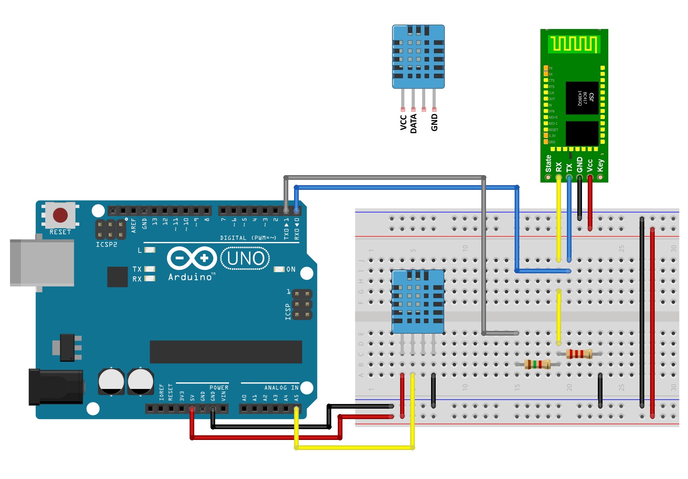

# Projeto Integrador 2 - 2019/1

Instituto Federal de Santa Catarina - *Campus* Florianópolis
Departamento Acadêmico de Eletrônica
Curso de Engenharia Eletrônica
Aluno: 
* Vítor Faccio - <vitorfaccio.ifsc@gmail.com>

Professores: 
* Fernando Miranda - <fernando.miranda@ifsc.edu.br>
* Luís Azevedo - <azevedo@ifsc.edu.br>

# Introdução
De acordo com o dicionário Michaelis, o termo “revolução” pode ser descrito como uma mudança profunda em algum ambiente ou sistema. Desta forma, conforme Branco (s.d.i.), caracterizam-se respectivamente as três revoluções industriais datadas nos séculos XVIII, XIX e XX: a invenção da máquina a vapor e sua inserção na manufatura têxtil, a aplicação da eletricidade nas indústrias e a integração entre ciência e produção.

As inovações do século XXI estão protagonizando uma quarta revolução industrial e tecnológica, que já é reconhecida globalmente no campo acadêmico e econômico. A “Indústria 4.0”, como pode ser chamado o novo patamar tecnológico, se difere das outras pela convergência entre os mundos físico, digital e biológico no âmbito industrial mas também escapando para o cotidiano das cidades. 

Destaca-se neste ambiente a robótica, o trânsito de dados, a comunicação entre equipamentos e a inteligência artificial. O aprimoramento das indústrias atuais requer a eliminação de ociosidade e disperdícios, o que flerta com o desenvolvimento de máquinas inteligentes. A informatização do chão de fábrica é capaz de tornar todo o processo de fabricação um ciclo controlado e otimizado, abrindo ainda espaço para a comunicação das máquinas com seres humanos e a redução de custos. 

Neste sentido é necessário haver uma boa base de armazenamento remoto de dados, possibilitando assim uma troca de informações rápida e eficiente com os mais diversos aparelhos. O armazenamento em nuvem surge ao lado da inteligência artificial como campo de desenvolvimento para a independência das máquinas na indústria, de forma que não seja mais pertinente uma mão humana controlando e tomando decisões.

A indústria 4.0 já possui relevância mundial: o Fórum Econômico Mundial, evento onde são tratados os rumos das grandes potências empresariais e governamentais do mundo, discute a presença destas inovações tecnológicas no futuro da economia mundial. O Fórum (2016) apresenta uma série de recomendações a líderes industrais para a adequação digital, como a criação de modelos de negócio digitais, digitalização dos planos estratégicos, aproveitamento de dados e integração da automação à força de trabalho. Mais tarde, o Fórum cita (2017) as 10 tecnologias mais emergentes do ano: todas se envolvem com o desenvolvimento de pesquisa e produção, mas três se relacionam especificamente com a eletrônica e a indústria 4.0, como a interação entre equipamentos na lavoura para gerar safras com mais precisão.

Tendo em vista o cenário de evolução dos sistemas tecnológicos e a necessidade de se adaptar o aprendizado às futuras vivências do profissional, este projeto possui enfoque na interconectividade de aparelhos aplicáveis em uma indústria 4.0. Será abordado o ambiente industrial de forma simulada, para que o aluno proponha, desenvolva e implante sobre ele tecnologias para a resolução do problema proposto. 

# Proposta
Este projeto visa o domínio e a compreensão de técnicas de projeto na engenharia eletrônica, abordando diversos aspectos da criação de um produto. A proposta se dá em torno da linha de produção de uma garrafa de suco de uva, de forma que se obtenha ao fim do semestre um sistema capaz de agir como captador de dados e aplicável em uma indústria real. É tido como foco dos estudos a organização do projeto em quatro níveis:
1. Concepção
    * Definir as necessidades do cliente
    * Considerar tecnologias, estratégias e regulamentações
    * Desenvolver conceitos, técnicas e planos
2. Design
    * Plantas, desenhos e algoritmos que descrevem o que será implementado
3. Implementação
    * Transformação do design em produto
    * Manufatura, escrita de códigos, testes e validações
4. Operação
    * Utilizar o produto implementado para a entrega do serviço definido
    * Manutenção, evolução e recolhimento do sistema

Tendo isso em vista, é dado início à etapa de concepção do projeto.

# Concepção
O estágio de concepção serve como momento para o projetista conhecer o ambiente e os objetivos de seu cliente, bem como pré-requisitos e limitações. Desta forma a primeira tarefa realizada é a definição dos pré-requisitos, que devem ser implantados ou apresentados como soluções ao fim do processo. 

O ambiente industrial deve ser simulado em uma mini-bancada de madeira, onde serão inseridos os componentes do projeto para que se tenha um ambiente semelhante ao de uma fábrica, evitando as mazelas de uma esteira elétrica. Sobre esta plataforma serão implantados blocos para a realização das seguintes tarefas:
1. Verificação de rotulagem
2. Controle de nível de envase
3. Análise de cores de matéria-prima
4. Leitura OCR (*Optical Character Recognition*) de lote e validade
5. Inspeção e testes

A seguir é feita a análise e definição de tecnologias a serem empregadas em cada ponto. As limitações laboratoriais regem as decisões agora tomadas, pois a empregabilidade do produto final depende de disponibilidade e preço dos equipamentos a serem utilizados. As tecnologias empregadas neste projeto serão descritas a seguir. 

## Tecnologias empregadas
Os cinco blocos citados serão desenvolvidos  com  as seguintes tecnologias e equipamentos:
* Controle de nível de envase
	* Sensor de distância por ultrassom JSN-SR04T ligado a Arduino
	* Obtenção de altura do líquido por ultrassom através do bocal da garrafa
	* Criação de escala para relacionar altura e volume
	* Sensor funciona com emissor e receptor de onda em apenas um microfone, o que possibilita a detecção através do bocal estreito
* Análise de cores de matéria-prima
	* Sensor de cor TCS230 ligado a Arduino
	* Obtenção de componentes RGB (vermelho, verde e azul) da superfície analisada
	* Interpretação dos dados e cálculo da cor resultante por conta do Arduino
* Inspeção e testes
	* Controle de temperatura do produto - fator chave na produção de alimentos e bebidas
	* Sensor de temperatura por infravermelho MLX90614 ligado a Arduino
	* Medição da temperatura sem necessitar de contato com o objeto, permitindo mais liberdade de movimentação
* Verificação de rotulagem / Leitura OCR de lote e validade
	* União dos dois estágios para utilização de apenas uma câmera
	* *Webcam* ligada ao *notebook*
	* Processamento de imagem por Python
	* Uso de tecnologia Tesseract OCR para reconhecimento de caracteres do rótulo e de lote e validade
	* Estágio em avaliação de estruturas

As tecnologias envolvidas com a estrutura do projeto, que garantem o funcionamento e a comunicação destes blocos, devem seguir a possibilidade de serem transportadas a uma planta industrial, supondo a substituição de uma plataforma modelo por uma real. Desta forma, elas são definidas como as seguintes:
* Um Arduino Uno para controle dos sensores e comunicação
* Um sensor de presença por infravermelho TCRT5000 em cada estágio do processo
* Arduino e *notebook* conectados via Bluetooth
	* Módulo HC-05 ligado ao Arduino
	* Leitura do Bluetooth por parte do *notebook* em Python
* Estrutura física:
	* Impressão 3D de alças para a bancada
	* Manufatura de peças em madeira para fixação dos sensores

Os equipamentos e métodos propostos acima envolvem-se com a obtenção e o processamento de dados, procedimentos indispensáveis em uma linha de produção. A intercomunicação do Arduino com o *notebook* e a utilização de softwares programáveis abrem espaço para a ampliação do sistema na quantidade de sensores e aplicabilidade, o que vai ao encontro do plano da Indústria 4.0.

# Design

A seção de *design* inicia-se com o resgate e a adaptação dos códigos necessários para o funcionamento dos sensores sobre o Arduino, além de conhecer seus esquemas de ligação. Todos os códigos que relacionam sensores ao Arduino são escritos na linguagem C++.

## Sensor de distância por ultrassom
O sensor utilizado, JSN-SR04T, possui apenas 1 microfone e permite a medição através de locais mais estreitos. Sua faixa de funcionamento parte de 20 cm e sua operação é idêntica à do sensor HC-SR04, medidor muito mais comum mas inapropriado por possuir dois microfones. O código base obtido é próprio do segundo equipamento, mas devido às semelhanças entre os dois é possível utilizá-lo para controlar o primeiro. 

Este código foi obtido no tutorial de funcionamento do sensor HC-SR04 com Arduino do *site* "Filipeflop", escrito por Adilson Thomsen (2011). Sua descrição é acompanhada da figura 1, que ilustra as ligações do sensor para este exemplo.
```c++
//Programa: Conectando Sensor Ultrassonico HC-SR04 ao Arduino
//Autor: FILIPEFLOP
 
//Carrega a biblioteca do sensor ultrassonico
#include <Ultrasonic.h>
 
//Define os pinos para o trigger e echo
#define pino_trigger 4
#define pino_echo 5
 
//Inicializa o sensor nos pinos definidos acima
Ultrasonic ultrasonic(pino_trigger, pino_echo);
 
void setup()
{
  Serial.begin(9600);
  Serial.println("Lendo dados do sensor...");
}
 
void loop()
{
  //Le as informacoes do sensor, em cm e pol
  float cmMsec, inMsec;
  long microsec = ultrasonic.timing();
  cmMsec = ultrasonic.convert(microsec, Ultrasonic::CM);
  inMsec = ultrasonic.convert(microsec, Ultrasonic::IN);
  //Exibe informacoes no serial monitor
  Serial.print("Distancia em cm: ");
  Serial.print(cmMsec);
  Serial.print(" - Distancia em polegadas: ");
  Serial.println(inMsec);
  delay(1000);
}

```
Figura 1 - Esquemático base do sensor HC-SR04


A maneira de se medir o nível de envase é ilustrada na figura 2, onde são mostradas três grandezas de distância: h_sensor, d_sensor-líquido e h_líquido. A altura h_sensor é fixa, estando o sensor preso à mesa, enquanto a distância d_sensor-líquido depende do nível de envase e consequentemente é capaz de informar a quantidade de líquido dentro da garrafa. 

Figura 2 - Diagrama de medição com o sensor JSN-SR04T


## Sensor de cor
O sensor de cor TCS230 é facilmente implementável no Arduino e conta com código base pronto, obtido por meio do site "Arduino e Cia" (2014). Conjuntamente é disposto seu esquemático na figura 3.

```c++
// Programa : Detector de cores usando modulo TCS230  
// Alteracoes e comentarios : Arduino e Cia  
//  
// Baseado no programa original de Martin Mason  
   
//Pinos de conexao do modulo TCS230  
const int s0 = 8;  
const int s1 = 9;  
const int s2 = 12;  
const int s3 = 11;  
const int out = 10;   
   
//Pinos dos leds  
int pinoledverm = 2;  
int pinoledverd = 3;  
int pinoledazul = 4;  
    
//Variaveis que armazenam o valor das cores  
int red = 0;  
int green = 0;  
int blue = 0;  
    
void setup()   
{  
  pinMode(s0, OUTPUT);  
  pinMode(s1, OUTPUT);  
  pinMode(s2, OUTPUT);  
  pinMode(s3, OUTPUT);  
  pinMode(out, INPUT);  
  pinMode(pinoledverm, OUTPUT);  
  pinMode(pinoledverd, OUTPUT);  
  pinMode(pinoledazul, OUTPUT);  
  Serial.begin(9600);  
  digitalWrite(s0, HIGH);  
  digitalWrite(s1, LOW);  
}  
    
void loop() 
{  
  color(); //Chama a rotina que le as cores  
  //Mostra no serial monitor os valores detectados  
  Serial.print("Vermelho :");  
  Serial.print(red, DEC);  
  Serial.print(" Verde : ");  
  Serial.print(green, DEC);  
  Serial.print(" Azul : ");  
  Serial.print(blue, DEC);  
  Serial.println();  

  //Verifica se a cor vermelha foi detectada  
  if (red < blue && red < green && red < 100)  
  {  
   Serial.println("Vermelho");  
   digitalWrite(pinoledverm, HIGH); //Acende o led vermelho  
   digitalWrite(pinoledverd, LOW);  
   digitalWrite(pinoledazul, LOW);  
  }  

  //Verifica se a cor azul foi detectada  
  else if (blue < red && blue < green)   
  {  
   Serial.println("Azul");  
   digitalWrite(pinoledverm, LOW);  
   digitalWrite(pinoledverd, LOW);  
   digitalWrite(pinoledazul, HIGH); //Acende o led azul  
  }  

  //Verifica se a cor verde foi detectada  
  else if (green < red && green < blue)  
  {  
   Serial.println("Verde");  
   digitalWrite(pinoledverm, LOW);  
   digitalWrite(pinoledverd, HIGH); //Acende o led verde  
   digitalWrite(pinoledazul, LOW);  
  }  
  Serial.println();  

  //Aguarda 2 segundos, apaga os leds e reinicia o processo  
  delay(2000);   
  digitalWrite(pinoledverm, LOW);  
  digitalWrite(pinoledverd, LOW);  
  digitalWrite(pinoledazul, LOW);  
 }  
    
void color()  
{  
  //Rotina que le o valor das cores  
  digitalWrite(s2, LOW);  
  digitalWrite(s3, LOW);  
  //count OUT, pRed, RED  
  red = pulseIn(out, digitalRead(out) == HIGH ? LOW : HIGH);  
  digitalWrite(s3, HIGH);  
  //count OUT, pBLUE, BLUE  
  blue = pulseIn(out, digitalRead(out) == HIGH ? LOW : HIGH);  
  digitalWrite(s2, HIGH);  
  //count OUT, pGreen, GREEN  
  green = pulseIn(out, digitalRead(out) == HIGH ? LOW : HIGH);  
}
```
Figura 3 - esquemático base do sensor TCS230


## Sensor de temperatura por infravermelho
Obtido por meio do site "Arduino e Cia" (2019), o código base para implementação do sensor de temperatura é disponibilizado abaixo, junto de seu esquemático (figura 4). 
```c++
//Programa: Sensor de temperatura I2C MLX90614 Arduino
//Autor: Arduino e Cia

#include <Wire.h>
#include <Adafruit_MLX90614.h>
#include <LiquidCrystal_I2C.h>

Adafruit_MLX90614 mlx = Adafruit_MLX90614();

//Define o endereco I2C do display e qtde de colunas e linhas
LiquidCrystal_I2C lcd(0x3B, 16, 2);

//Array que desenha o simbolo de grau
byte grau[8] = {B00110, B01001, B01001, B00110,
                B00000, B00000, B00000, B00000,};

double temp_amb;
double temp_obj;

void setup()
{
  Serial.begin(9600);
  Serial.println("Sensor de temperatura MLX90614");

  //Inicializa o display LCD I2C
  lcd.init();
  lcd.backlight();

  //Atribui a "1" o valor do array "grau", que desenha o simbolo de grau
  lcd.createChar(1, grau);

  //Inicializa o MLX90614
  mlx.begin();
}

void loop()
{
  //Leitura da temperatura ambiente e do objeto
  //(para leitura dos valores em Fahrenheit, utilize
  //mlx.readAmbientTempF() e mlx.readObjectTempF() )
  temp_amb = mlx.readAmbientTempC();
  temp_obj = mlx.readObjectTempC();

  //Mostra as informacoes no display
  lcd.setCursor(0, 0);
  lcd.print("Ambiente:");
  lcd.setCursor(10, 0);
  lcd.print(temp_amb);
  lcd.setCursor(15, 0);
  lcd.write(1);
  lcd.setCursor(0, 1);
  lcd.print("Objeto:");
  lcd.setCursor(10, 1);
  lcd.print(temp_obj);
  lcd.setCursor(15, 1);
  lcd.write(1);

  //Mostra as informacoes no Serial Monitor
  Serial.print("Ambiente = ");
  Serial.print(temp_amb);
  Serial.print("*C\tObjeto = ");
  Serial.print(temp_obj); Serial.println("*C");

  //Aguarda 1 segundo ate nova leitura
  delay(1000);
}
```
Figura 4 - Esquemático base do sensor MLX90614


## Sensor de presença por infravermelho
A implementação do sensor de presença é muito simples, requerindo um código curto e poucos componentes para o acionamento do equipamento. O código abaixo serve para o funcionamento do sensor ativando um LED em função do estado do sensor.
```c++
int pinoLed = 8; //PINO DIGITAL UTILIZADO PELO LED  
int pinoSensor = 7; //PINO DIGITAL UTILIZADO PELO SENSOR
   
void setup(){  
  pinMode(pinoSensor, INPUT); //DEFINE O PINO COMO ENTRADA
  pinMode(pinoLed, OUTPUT); //DEFINE O PINO COMO SAÍDA   
  digitalWrite(pinoLed, LOW); //LED INICIA DESLIGADO
}  
   
void loop(){
  if (digitalRead(pinoSensor) == LOW){ //SE A LEITURA DO PINO FOR IGUAL A LOW, FAZ
        digitalWrite(pinoLed, HIGH); //ACENDE O LED
  }else{//SENÃO, FAZ
        digitalWrite(pinoLed, LOW); //APAGA O LED
  }    
}
```


## Módulo Bluetooth
Os dados obtidos no sensoreamento devem ser enviados para o *notebook* utilizado a fim de integrá-los à etapa de verificação de imagem. Está disponível publicamente um exemplo de controle de luz com Python e Arduino, escrito por Noah Huber-Feely (2016), que aborda os códigos dos dois equipamentos. O código base para o Arduino é mostrado a seguir.

```c++
//Include the SoftwareSerial library
#include "SoftwareSerial.h"

//Create a new software  serial
SoftwareSerial bluetooth(2, 3); // TX, RX (Bluetooth)
  
const int ledPin = 13; // the pin that the LED is attached to
int incomingByte;      // a variable to read incoming serial data into

void setup() {
  //Initialize the software serial
  bluetooth.begin(9600);
  
  // initialize the LED pin as an output:
  pinMode(ledPin, OUTPUT);
}

void loop() {
  // see if there's incoming serial data:
  if (bluetooth.available() > 0) {
    // read the oldest byte in the serial buffer:
    incomingByte = bluetooth.read();
    // if it's a capital H (ASCII 72), turn on the LED:
    if (incomingByte == 'H') {
      digitalWrite(ledPin, HIGH);
      bluetooth.println("LED: ON");
    }
    // if it's an L (ASCII 76) turn off the LED:
    if (incomingByte == 'L') {
      digitalWrite(ledPin, LOW);
      bluetooth.println("LED: OFF");
    }
  }
}
```
O código base deste exemplo para Python é apresentado a seguir.

```python
# This project requires PyBluez
from Tkinter import *
import bluetooth

#Look for all Bluetooth devices
#the computer knows about.
print "Searching for devices..."
print ""
#Create an array with all the MAC
#addresses of the detected devices
nearby_devices = bluetooth.discover_devices()
#Run through all the devices found and list their name
num = 0
print "Select your device by entering its coresponding number..."
for i in nearby_devices:
	num+=1
	print num , ": " , bluetooth.lookup_name( i )

#Allow the user to select their Arduino
#bluetooth module. They must have paired
#it before hand.
selection = input("> ") - 1
print "You have selected", bluetooth.lookup_name(nearby_devices[selection])
bd_addr = nearby_devices[selection]

port = 1

#Create the GUI
class Application(Frame):

#Create a connection to the socket for Bluetooth
#communication
    sock = bluetooth.BluetoothSocket( bluetooth.RFCOMM )

    def disconnect(self):
    	#Close socket connection to device
        self.sock.close()
        
    def on(self):
    	#Send 'H' which the Arduino
    	#detects as turning the light on
        data = "H"
        self.sock.send(data)

    def off(self):
    	#Send 'L' to turn off the light
    	#attached to the Arduino
        data = "L"
        self.sock.send(data)

    def createWidgets(self):
    	#Form all the buttons.
    	#Look at a Tkinter reference
    	#for explanations.
        self.QUIT = Button(self)
        self.QUIT["text"] = "QUIT"
        self.QUIT["fg"]   = "red"
        self.QUIT["command"] =  self.quit

        self.QUIT.pack({"side": "left"})

        self.disconnectFrom = Button(self)
        self.disconnectFrom["text"] = "Disconnect"
        self.disconnectFrom["fg"]   = "darkgrey"
        self.disconnectFrom["command"] =  self.disconnect

        self.disconnectFrom.pack({"side": "left"})

        self.turnOn = Button(self)
        self.turnOn["text"] = "On",
        self.turnOn["fg"] = "green"
        self.turnOn["command"] = self.on

        self.turnOn.pack({"side": "left"})

        self.turnOff = Button(self)
        self.turnOff["text"] = "Off"
        self.turnOff["fg"] = "red"
        self.turnOff["command"] = self.off

        self.turnOff.pack({"side": "left"})

    def __init__(self, master=None):
    	#Connect to the bluetooth device
    	#and initialize the GUI
        self.sock.connect((bd_addr, port))
        Frame.__init__(self, master)
        self.pack()
        self.createWidgets()

#Begin the GUI processing
root = Tk()
app = Application(master=root)
app.mainloop()
root.destroy()
```
Há um ponto que deve ser cuidado: o módulo Bluetooth trabalha com tensão de 3,3 V, enquanto as portas do Arduino trabalham com 5 V. A figura 5, obtida no site "Filipeflop" (2015), apresenta uma solução simples: um mero divisor resistivo no pino RX do dispositivo.

Figura 5 - Adaptação de nível de tensão para o módulo HC-05


## Reconhecimento de imagem
A etapa de reconhecimento de imagem tem suas bases divididas em duas partes: a obtenção da imagem da câmera e o reconhecimento em si; para cada uma recorreu-se a uma fonte distinta, mas elas foram estudadas e testadas conjuntamente.

A seção de recuperação da imagem por câmera foi escrita com base em funções das bibliotecas CV2 e *tal* (TERMINAR ESTA PARTE, FORMATEI O COMPUTADOR E AINDA NÃO TENHO ACESSO AOS ARQUIVOS DE PYTHON).

A mesma biblioteca conta com funções de processamento de imagem, que são requeridas na etapa de leitura OCR. O texto utilizado como base para esta parte foi escrito por Ronal Rodrigues (2017) e explica os diversos pontos necessários para a atividade. A seguir é apresentado o código final de seu exemplo. A imagem da câmera deve substituir a leitura do arquivo 'saoluis.jpg' na oitava linha.

```python
import pytesseract as ocr
import numpy as np
import cv2

from PIL import Image

# tipando a leitura para os canais de ordem RGB
imagem = Image.open('saoluis.jpg').convert('RGB')

# convertendo em um array editável de numpy[x, y, CANALS]
npimagem = np.asarray(imagem).astype(np.uint8)  

# diminuição dos ruidos antes da binarização
npimagem[:, :, 0] = 0 # zerando o canal R (RED)
npimagem[:, :, 2] = 0 # zerando o canal B (BLUE)

# atribuição em escala de cinza
im = cv2.cvtColor(npimagem, cv2.COLOR_RGB2GRAY) 

# aplicação da truncagem binária para a intensidade
# pixels de intensidade de cor abaixo de 127 serão convertidos para 0 (PRETO)
# pixels de intensidade de cor acima de 127 serão convertidos para 255 (BRANCO)
# A atrubição do THRESH_OTSU incrementa uma análise inteligente dos nivels de truncagem
ret, thresh = cv2.threshold(im, 127, 255, cv2.THRESH_BINARY | cv2.THRESH_OTSU) 

# reconvertendo o retorno do threshold em um objeto do tipo PIL.Image
binimagem = Image.fromarray(thresh) 

# chamada ao tesseract OCR por meio de seu wrapper
phrase = ocr.image_to_string(binimagem, lang='por')

# impressão do resultado
print(phrase) 
```
Após ser feita a leitura do rótulo da garrafa e seu lote e validade, todas as informações requeridas do processo estão prontas e podem se finalizar expondo-as ao usuário ou exportando-as a alguma base de dados.

## Disponibilidade de pinos no Arduino
Todos os sensores a serem ligados no Arduino requerem pinos para haver a comunicação. Os pinos de alimentação e terra não precisam ser contabilizados pois podem compartilhar de uma mesma saída da placa, mas deve se ter em vista todos os que requeiram saídas digitais ou analógicas. Desta forma, é feita a análise:

  Tipo de sensor ou dispositivo | Quantidade de pinos necessários
  -------------  | -------------
  Distância      | 2 
  Cor            | 5 
  Temperatura    | 2 (Analógicos) 
  Presença (x4)  | 4 
  Bluetooth | 2

Estes valores estão adequados ao uso em um Arduino Uno.

# Referências bibliográficas
(arrumar com o tempo)
Código base JSN-SR04T-2.0 (distância): https://www.filipeflop.com/blog/sensor-ultrassonico-hc-sr04-ao-arduino/

Código base TCS230 (cor): https://www.arduinoecia.com.br/2014/02/sensor-de-reconhecimento-de-cor-tcs230.html

Código base MLX90614 (temperatura): https://www.arduinoecia.com.br/2019/03/sensor-de-temperatura-mlx90614-arduino.html

Código base TCRT5000 (presença): http://blogmasterwalkershop.com.br/arduino/arduino-utilizando-o-sensor-reflexivo-tcrt5000/

Código base bluetooth - arduino e python: https://create.arduino.cc/projecthub/nhuberfeely/remote-bluetooth-light-control-with-python-8308fc

Lendo imagens - OCR com Google Tesseract e Python:
https://blog.codeexpertslearning.com.br/lendo-imagens-uma-abordagem-%C3%A0-ocr-com-google-tesseract-e-python-ee8e8009f2ab

Utilização de câmera ligada ao notebook com Python: https://gist.github.com/radames/1e7c794842755683162b

